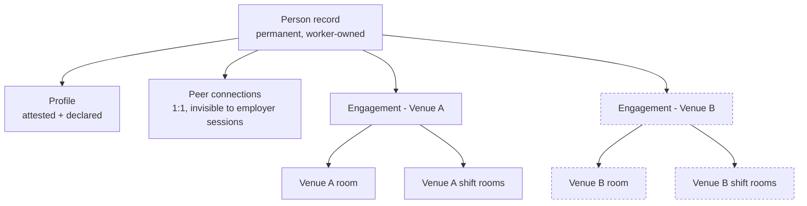

# Worker-owned identity; the employer holds a lease

## Summary

A worker-owned account for hospitality staff, where an employer holds a fixed-term engagement rather than owning the account. Venues get a persistent room driven by active engagements plus shift rooms computed from the roster, both run from a simplified employer backoffice. The worker's profile and 1:1 peer connections sit outside all of it and outlive the engagement.

---

## Problem Frame

Hospitality runs its day-to-day coordination on WhatsApp, in groups a manager assembles by hand. The industry turns over 70–100% of its staff annually, so those groups decay continuously: a leaver stays in the group until someone remembers to remove them, and the group's accumulated context belongs to whoever created it. When that person quits, the context leaves with them.

Every purpose-built alternative reproduces the underlying flaw. The account is provisioned by the employer, so it must be deprovisioned by the employer, and at this churn rate that is a permanent administrative tax and a permanent data-liability surface. Spain's data protection authority fined LVMH Iberia €70,000, reduced to €42,000, for adding an employee's personal number to a work WhatsApp group after she opted out — the adjudicated version of the same harm.

The industry's shape makes the employer-owned model wrong on a second count. Leisure and hospitality supplies 16% of all secondary jobs in the US, behind only health care at 17%. A meaningful share of workers hold two jobs at once, and an account scoped to one employer cannot represent that person.

---

## Key Decisions

**The person record is the root, and an engagement attaches to it.** An employer never creates or owns an account. Only the person creates their own record; an employer can at most issue an invitation the person claims. The employer then holds an engagement with a start and an end date, which grants scoped access and nothing more. This is the decision that cannot be retrofitted — every other behaviour in this document inherits its shape from it.

**Engagements are fixed-term, and that is the fail-safe.** There is no open-ended engagement, because most hospitality contracts are permanent or zero-hours and an open-ended form would put the manager back where WhatsApp leaves them: remembering to end something. A forgotten renewal ends access; a forgotten removal would not. The backoffice surfaces renewals rather than terminations.

**Peer connections outlive employment.** A connection formed at a venue survives the end of the engagement that produced it. This is what makes the account genuinely the worker's rather than employer-scoped with extra steps. It carries two costs, both deliberate: a venue cannot sever a relationship formed on its own floor, and the employer's duty of care toward conversations its own roster made possible has no product surface. The only in-product remedy is worker-side disconnection.

**Co-rostering reveals; consent connects.** Working a shift together makes two people visible to each other, scoped to the engagement, and that visibility keeps a thirty-day tail after either engagement ends — because the moment people decide to stay in touch is usually the moment one of them leaves. Turning visibility into a permanent connection still takes a request and an acceptance. The roster does the discovery work without an employer's rostering decision creating a permanent artifact in someone else's account.

**The profile separates attested entries from declared ones.** Engagement history is asserted by the employer that held the engagement and cannot be edited by the worker; skills and certifications are worker-authored and shown as such. Attested means *not self-authored*, not *verified* — nothing here checks that a venue is real. The split narrows the taxonomy rather than removing it: venue and dates are comparable across employers, while role remains the employer's own label with no cross-employer comparability claimed.

**Disclosure follows ownership.** The worker decides which employers see which attested entries, with concurrent engagements elsewhere hidden by default. Peers are governed by a separate setting that defaults more open, because the worker opted into the connection. Every entry shows the worker its current audience, since a control nobody can verify is nominal.

**Rooms have two sources.** The venue room is bounded by active engagements, so ending one removes the person from something immediately. Shift rooms are computed from the roster. Both are derived; neither has a hand-maintained membership list. Membership is *bounded by* rather than *identical to* the engagement set, so a worker can step out of a room without stepping out of the job.

**A shift room's afterlife belongs to the shift's type.** How long a room stays open once its shift ends is a property of the type, so a close and a breakfast service can differ.

**The two-zone boundary is between sessions, not between people.** A venue manager is usually also rostered staff, so one human can hold a person record, peer connections, and backoffice authority at once. The guarantees are therefore stated against an employer-scoped session, and enforced at the data-access layer rather than by omitting a route.

---

## Actors

- A1. Worker — a person holding zero or more engagements. Owns their record, profile, and peer connections.
- A2. Venue manager — a person record holding an engagement at a venue plus an employer-scoped grant. Builds rosters, starts and ends engagements, reads that venue's rooms.
- A3. Employer (venue) — the organisation whose scope bounds an employer-scoped session. Not itself a user.

---

## Ownership boundary

Ending the Venue B engagement removes the dashed branch. The person record, the profile, the peer connections, and the Venue A engagement are untouched. A copy of the worker's own messages from the Venue B rooms remains readable to them; the rest of those rooms does not. Ending *every* engagement removes both branches and leaves the person record fully functional — the state no employer-provisioned account can occupy.

---

## Requirements

**Identity and engagement**

- R1. A person record is created once and persists independently of any employer. No employer can create, own, or delete it.
- R2. A person record is created only by the person themselves. An employer action can at most produce an invitation; an unclaimed invitation grants no access and creates no record.
- R3. An employer's relationship to a person is an engagement with a start date and an end date, granting scoped access only.
- R4. Every engagement is fixed-term and renewable. There is no open-ended form.
- R5. An engagement becomes active only when the person accepts the invitation against their own person record. No employer-facing search over the person directory exists.
- R6. Ending an engagement revokes that person's access to that venue's rooms immediately, terminating their open room subscriptions as part of the same action rather than on their next request.
- R7. Ending an engagement leaves the person's access at every other venue untouched.
- R8. After an engagement ends, the person retains a readable copy of their own messages from that venue's rooms, and nothing else from those rooms.
- R9. Retained own-message copies live in an archived-engagements area of the person's room list, presenting the room interface filtered to their own messages and visually distinct from a room that is read-only but current.

**Rooms and membership**

- R10. Each venue has one persistent venue room whose membership is bounded by the people holding an active engagement there.
- R11. A person may suspend their own venue-room membership without ending the engagement. No employer-scoped session can suspend it for them.
- R12. Each rostered shift has a shift room whose membership is the people rostered on that shift who hold an active engagement, snapshotted when the shift starts. Later roster edits add members but never withdraw access to messages already sent.
- R13. Room membership is derived from engagements and rosters. No one adds or removes a member by hand.
- R14. Venue and shift room history is readable in full by anyone holding an active engagement at that venue, including messages posted before their engagement began.
- R15. A shift room accepts new messages until a grace period defined by that shift's type, capped at two hours.
- R16. After the grace period, a shift room is readable but closed to new messages, for the people in its start-of-shift membership snapshot.
- R17. A room closed to new messages displays that state explicitly, and a send rejected after the grace period surfaces an explicit message rather than failing silently.

**Peer connections**

- R18. Being rostered on the same shift makes two people visible to each other within that engagement.
- R19. Co-rostered visibility persists for thirty days after either person's engagement ends, then lapses.
- R20. A permanent peer connection requires a request from one person and acceptance by the other.
- R21. A connection request is pending and visible to both parties until answered. A declined request is visible to the requester and cannot be re-sent without fresh acceptance. A pending request expires when co-rostered visibility lapses.
- R22. A peer connection persists after either or both underlying engagements end.
- R23. Either party may end a peer connection unilaterally at any time. Ending it closes the 1:1 conversation to new messages for both, leaves each party a readable copy of their own messages, and prevents a further request from the removed party without fresh acceptance.
- R24. Peer conversation is 1:1 only and is readable by no employer-scoped session.

**Profile and disclosure**

- R25. A profile carries attested entries derived from engagements — venue, role label, dates — which the person cannot edit.
- R26. An engagement carries an employer-authored role label. No cross-employer comparability is claimed for it.
- R27. A person may attach a correction request to an attested entry. The authoring employer can accept it, amending the entry, or decline it, leaving both the entry and the unresolved request visible to any viewer of that entry.
- R28. A profile carries declared entries authored by the person, displayed as self-declared.
- R29. The person controls which employers see which attested entries. Engagements concurrent with the viewing employer's own are hidden by default.
- R30. The person controls which peers see which attested entries, under a setting separate from the employer control and defaulting more open.
- R31. Each attested entry surfaces its current audience to the person, and changing a disclosure setting confirms the new state.
- R32. Every employer-facing profile view carries a standing notice that attested entries are subject to the person's disclosure settings and may be incomplete, shown identically whether or not any entries are hidden.

**Data lifecycle**

- R33. A person can request erasure of their person record, profile entries, and retained own-message copies.
- R34. Erasure reduces attested entries referencing that person, held by an employer, to a non-identifying engagement record, so an employer's own history stays coherent without retaining the person.
- R35. Retained own-message copies and closed room history are deleted twenty-four months after the engagement that produced them ends.

**Employer backoffice**

- R36. An employer-scoped session can create a venue with a minimum set of details and manage them.
- R37. A venue manager is a person record holding an engagement at that venue plus an employer-scoped grant. Backoffice capabilities derive from that grant, not from a separate account type.
- R38. An employer-scoped session can invite and end engagements at its own venue, and surfaces a renewal action for engagements approaching their end date.
- R39. An employer-scoped session can define shift types for its venue, each carrying a grace period within the two-hour cap.
- R40. An employer-scoped session can build a roster placing people with active engagements onto shifts, each shift carrying a shift type.
- R41. An employer-scoped session can read the venue room and shift rooms of its own venue only.
- R42. An employer-scoped session holds no capability that can name or resolve a peer conversation, or an attested entry the person has hidden from that employer. This is enforced at the data-access layer, not the route layer.

**Demonstration**

- R43. A demo control fast-forwards a chosen engagement to its end date.
- R44. The demo control can end every engagement a person holds.
- R45. Seed data provides two employers and at least three people, one of whom holds concurrent engagements at both employers.

---

## Key Flows

- F1. A venue is created
  - **Trigger:** A manager sets up a venue in the backoffice.
  - **Actors:** A2
  - **Steps:** The manager supplies the minimum venue details. The venue room comes into existence with no members. Shift types can then be defined.
  - **Outcome:** A venue exists with an empty membership, ready for invitations.
  - **Covers:** R10, R36, R39

- F2. A person joins a venue
  - **Trigger:** A manager invites someone to work at the venue.
  - **Actors:** A1, A2
  - **Steps:** The manager issues an invitation. The person accepts it from their own account, attaching a fixed-term engagement to their existing record. No directory search occurred, and no record was created by the employer.
  - **Outcome:** The person holds an engagement they consented to, on a record the employer does not own.
  - **Covers:** R1, R2, R3, R4, R5, R38

- F3. An engagement ends
  - **Trigger:** A manager ends an engagement, a fixed term lapses unrenewed, or the demo control fast-forwards it.
  - **Actors:** A1, A2
  - **Steps:** The engagement closes and open room subscriptions terminate in the same action. The person leaves the venue room and every shift room at that venue, and disappears from that venue's rosterable pool. Their own messages remain readable in their archived-engagements area.
  - **Outcome:** No manual removal occurred anywhere, and the person's other engagements are unaffected.
  - **Covers:** R6, R7, R8, R9, R10, R43

- F4. A shift room opens and closes
  - **Trigger:** A shift begins on the roster.
  - **Actors:** A1, A2
  - **Steps:** The room opens with the rostered people as members and snapshots that membership. The shift ends. The room stays open for the grace period carried by the shift's type, then closes to new messages while remaining readable to the snapshot.
  - **Outcome:** Wrap-up conversation has somewhere to land without shift rooms accumulating as live channels.
  - **Covers:** R12, R13, R15, R16, R17, R39

- F5. A peer connection forms, survives, and can be ended
  - **Trigger:** Two people are rostered on the same shift.
  - **Actors:** A1
  - **Steps:** Each becomes visible to the other within the engagement. One sends a request; it sits pending until the other accepts. Later one engagement ends, and visibility lapses after its thirty-day tail. Either party can end the connection at any point.
  - **Outcome:** The engagement-scoped visibility is gone; the accepted connection and its conversation remain, readable by no employer-scoped session, and revocable by either party.
  - **Covers:** R18, R19, R20, R21, R22, R23, R24

- F6. Reaching across employers after leaving
  - **Trigger:** A person whose engagement at one venue has ended messages a peer who still works there.
  - **Actors:** A1
  - **Steps:** The 1:1 conversation opens from the peer connection rather than from any venue context. No employer-scoped session can read it. Either party may end it.
  - **Outcome:** The relationship formed at a venue outlives the job at that venue, without becoming unrevocable.
  - **Covers:** R22, R23, R24

---

## Acceptance Examples

- AE1. Expiry revokes venue access and preserves own messages
  - **Given** a person holds engagements at Venue A and Venue B and has posted in both venue rooms
  - **When** the Venue B engagement ends
  - **Then** their open Venue B subscriptions terminate without a page reload, they can still read their own Venue B messages under archived engagements, and Venue A is unchanged
  - **Covers R6, R7, R8, R9.**

- AE2. Grace window on a shift room
  - **Given** a shift room whose shift type carries a two-hour grace period, and whose shift ended thirty minutes ago
  - **When** a member posts
  - **Then** the message is accepted; after the grace period the same action is refused with an explicit message while the room stays readable to the start-of-shift snapshot
  - **Covers R15, R16, R17, R39.**

- AE3. Peer connection survives expiry and stays revocable
  - **Given** two people connected as peers while both engaged at the same venue
  - **When** one person's engagement there ends
  - **Then** the connection and its conversation remain available to both, no employer-scoped session can read it, and either party can still end it
  - **Covers R22, R23, R24.**

- AE4. Concurrent engagement hidden by default
  - **Given** a person holds concurrent engagements at Venue A and Venue B and has changed no visibility setting
  - **When** Venue A's manager views that person's profile
  - **Then** the Venue B engagement is not shown, and the standing incompleteness notice appears exactly as it would for a person with nothing hidden
  - **Covers R29, R32.**

- AE5. Roster change moves membership without an admin action
  - **Given** a shift room derived from tonight's roster
  - **When** a manager adds a person with an active engagement to that shift
  - **Then** that person is a member of the shift room, with no add-member step performed, and no existing member loses access to messages already sent
  - **Covers R12, R13, R40.**

- AE6. The boundary holds below the interface
  - **Given** a manager authenticated for Venue A and the identifier of a peer conversation between two of its staff
  - **When** the manager issues a direct API request for it
  - **Then** the request is refused by the same check that governs the interface, and the same holds for an attested entry hidden from that employer
  - **Covers R24, R42.**

- AE7. A person with no employer is still a full user
  - **Given** a person holding engagements at two venues
  - **When** the demo control ends every engagement they hold
  - **Then** their profile, peer connections, and 1:1 conversations remain fully functional while they are employed nowhere
  - **Covers R1, R22, R24, R44.**

---

## Success Criteria

- The demo runs end to end without narration: fast-forward an engagement to expiry, watch venue access disappear live, watch the peer conversation survive.
- The demo reaches a person holding zero engagements whose account still works, and a reviewer who has watched it can state why an employer-provisioned account could not occupy that state.
- Attempting to reach peer conversation or hidden attested entries from an employer-scoped session fails below the interface as well as within it, and the failure is demonstrable rather than asserted.

---

## Scope Boundaries

**Deferred for later**

- Mobile clients.
- Integration with any real scheduling or HR system; rosters are entered in the backoffice.
- Verification that a venue or employer is real.
- Matching or comparing workers on role, which needs a catalogue that does not exist.
- The remaining directions from ideation: cross-venue mutual aid, worker-owned availability, place-anchored threads, WhatsApp export import.
- Offline behaviour and poor-connectivity handling.
- Rich messaging — threading, attachments, voice notes.
- Standing sub-venue groups (department, section, or team rooms).

**Outside this product's identity**

- Employer visibility into peer conversation. Foreclosed by design, not deferred. Where harm arises in a peer conversation, worker-side disconnection is the only in-product remedy; employers handle complaints out of band, and no employer-visible route exists at any severity.
- Any rating, score, or ranking of a worker. Attested entries record what happened; they do not evaluate it.
- A qualification taxonomy or standard position catalogue.

---

## Dependencies and Assumptions

- Elixir backend on Phoenix, with room membership and message delivery carried over Phoenix Channels and PubSub, consumed by a React web client. Mobile is a later phase, so nothing here may depend on native capability.
- Rosters originate in the backoffice. No external scheduling system is assumed to exist.
- The administrative-tax saving claimed in the Problem Frame holds only where the roster arrives from a system the venue already maintains. Backoffice roster entry is a POC substitution that increases manager effort relative to WhatsApp.
- Declared profile entries are free text. The POC assumes no hospitality position taxonomy is needed, which holds only while nothing tries to match or rank on those entries.
- The two-zone guarantee holds only if neither peer conversation nor an attested entry hidden from an employer is reachable through an employer-scoped query. This constrains how access is enforced, not merely how the interface is built.

---

## Outstanding Questions

**Deferred to planning**

- How a worker authenticates, given there is no employer to provision them.
- Whether the twenty-four-month retention period in R35 is the right value.
- Whether an attested entry records role granularity beyond a job title.
- What happens to a person rostered on a shift still in its grace period when their engagement ends.
- Whether shift types are per venue or shared across venues held by one employer.
- Whether a venue manager may form peer connections with staff they roster.

---

## Sources and Research

- `docs/ideation/2026-07-26-hospitality-worker-comms-ideation.html` — the ranked ideation set this brief was selected from, including the rejected alternatives and their reasons.
- NWCG Incident Qualification Card and IQCS — the portable cross-employer credential model behind the attested/declared split. Its output is Qualified / Trainee / Unqualified against a published position catalogue rather than a score, though the underlying Position Task Book uses an internal Meets/Exceeds scale before certification.
- AEPD (Spain) EXP202310848 — the LVMH Iberia fine for adding a worker's personal number to a work WhatsApp group after she opted out.
- US Bureau of Labor Statistics multiple-jobholding data — roughly 5% of employed workers hold more than one job; leisure and hospitality supplies 16% of secondary jobs, behind health care at 17%.
