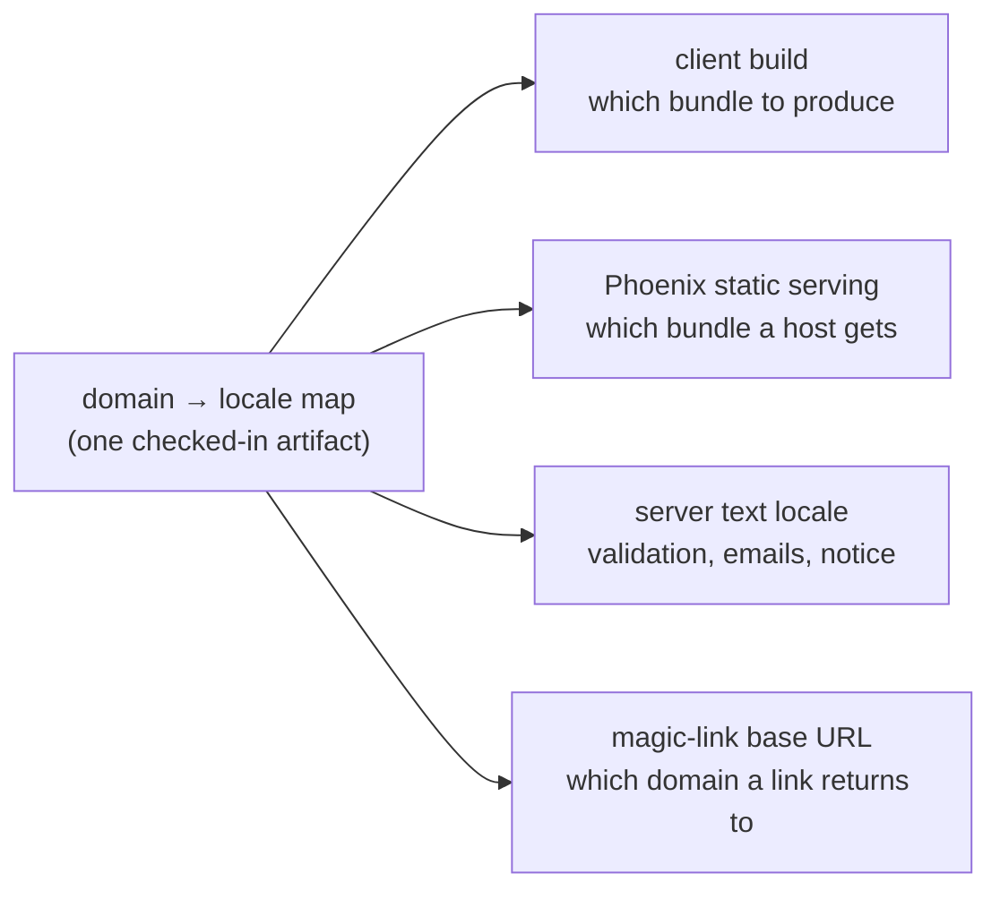

# Platform localization — English and Serbian

## Summary

Localize the platform's static text into English (default) and Serbian Latin, with the domain a
person arrives on deciding which they get. Copy moves out of components into flat per-locale
literal files; the client bakes them in at build time as one bundle per locale, and Phoenix serves
the matching bundle by request host while resolving the same locale for server-authored text.

## Problem Frame

Someone who does not read English cannot use this product at all. Every label, every refusal
sentence and every form message is English, and hospitality is an industry where the workforce is
routinely non-native in the country's business language. Outside an English-speaking market this is
a floor for usability rather than a polish item.

The tree is unusually well placed for it, and saying so bounds the work. The API's error envelope
documents `message` as being "for a human reading a log", and the React client deliberately does not
render it — every refusal a person reads is already client-side copy keyed on a machine code, in
five modules. So the API contract needs no change and localization is overwhelmingly a client
concern. Three server-originated surfaces are the exception. One of them, the pair of constants
erasure writes into the database, is a different kind of problem and is not in this scope.

## Key Decisions

**The domain is the only locale signal.** No in-app switcher, no `Accept-Language` negotiation, no
preference stored against a person. This keeps one rule with one input and no state, and it is what
makes a build-time bundle possible at all. The residue is real and accepted: a Serbian speaker who
reaches the English domain gets English and has no remedy inside the product.

**One bundle per locale, substituted at build time.** A production bundle contains one language and
no lookup, no fallback branch and no locale detection. The alternative — one bundle resolving a
dictionary at runtime — was weighed and rejected. The cost is that deployment must route by domain,
which is the reason the next decision exists.

**Phoenix serves the built client.** `lib/hospitality_coms_web/endpoint.ex` states that there is no
static file serving, and this reverses that. It is the only option that keeps the routing in-tree
and inside the test suite, and it reuses the domain mapping the server needs anyway. It also makes
client and API same-origin by construction, so CORS is never required — which
`client/vite.config.ts` already treats as the expected deployment shape. The consequence is
accepted: both bundles ship inside the Elixir release, so the client stops being independently
deployable and a copy change reaches production through a release rather than a static upload.

**The server derives locale from the request's `Origin`.** The client cannot be the authority here
because the server must write an email and a link back into a domain, so it needs the domain rather
than a language tag. `Referer` is not available: `client/index.html` sets a `no-referrer` policy on
purpose, to keep a magic-link token out of outbound headers.

**One domain mapping, read by every consumer.** The two decisions above put the domain rule on both
sides of the wire, and two copies of one rule drift. A single checked-in artifact is the mapping;
the client build, Phoenix's static routing, the server's text locale and the magic-link base URL all
read it, and none of them restates it.

**English is the source of truth for the key set.** A key exists because English has it. This makes
the developer's path unblocked — a new string ships before its translation exists — and gives the
translator a file whose shape is defined elsewhere rather than negotiated.

**A missing translation falls back loudly in development and quietly in production.** A translator
must never be able to redden CI, which rules out failing the build on a gap; but a gap that is only
visible in a report is a gap that ships. Splitting the behaviour by build mode gets both. The dev
marker must be structurally absent from a production bundle rather than present and unreachable —
the same property `dev_support/` gives the offsettable clock.

**Gettext carries the server-originated text.** It is already a dependency with a backend module and
no callers, its message catalogues are the same literal-file shape the client is adopting, and it
brings Serbian's three plural forms for the validation messages that need them.

### One mapping, four consumers

## Actors

A1. **Worker** — reads rooms, peers and their own record, usually on a phone during a shift.

A2. **Manager** — the employer surface, which is a person session plus a venue. Localized on the
same terms as the worker's; it is the single largest copy surface in the client.

A3. **Translator** — non-technical, works through GitHub, cannot be expected to read code or
diagnose a failing build. Two decisions above exist for this actor.

A4. **Developer** — adds English strings and must not be blocked waiting on translation.

## Key Flows

F1. **A person opens the platform.**
**Trigger:** a request for the application on either domain.
Phoenix matches the host against the mapping and serves that locale's bundle. The page's language
and title are correct on first paint, with no client-side detection and no flash of the wrong
language. **Covers R2, R4, R10, R16, R17.**

F2. **A person asks for a magic link from the Serbian domain.**
**Trigger:** a log-in request carrying an `Origin` on the Serbian domain.
The server resolves the locale from that header, writes the email in Serbian, and builds the link
against the Serbian domain so following it returns the person to the language they started in.
**Covers R11, R13, R15.**

F3. **A translator changes a Serbian string.**
**Trigger:** an edit to a translated value in a locale file.
The change is reviewable as a one-line diff, needs no code reading, and cannot fail the build. It
reaches production through the same build the developer's changes do. **Covers R6, R18.**

F4. **A developer adds an English string.**
**Trigger:** a new key in the English file with no Serbian counterpart.
The English build renders it. The Serbian production build renders the English text; the Serbian
development build renders a marker. The build reports the key as untranslated. **Covers R7, R9,
R19, R20.**

## Requirements

### Locale resolution

R1. The platform supports exactly two locales: `en` as the default and `sr-Latn`. English is the
fallback for every surface.

R2. The locale a person receives is determined solely by the domain they access the platform on.

R3. A single checked-in artifact maps domain to locale, and every consumer reads it rather than
restating the rule.

R4. A domain the mapping does not name resolves to the default locale. Local development, preview
hosts and direct IP access are covered by that rule rather than by special cases.

### Client copy

R5. Every string a person can read on the client comes from a per-locale literal file. No
user-facing English remains inline in a component.

R6. Literal files are flat key-to-string maps in a format a non-developer can edit and a reviewer
can diff line by line.

R7. The English file defines the key set; a key absent from English is not a key.

R8. Strings are substituted at build time, so a production bundle carries one locale and contains no
lookup or fallback code.

R9. A key present in English and missing in the target locale renders the English string in a
production build, and renders a visibly wrong marker in development and test builds. The marker is
structurally absent from a production bundle rather than merely unreachable.

R10. The page shell's language attribute and document title carry the built locale, correct on first
paint.

### Server-originated text

R11. The server resolves a request's locale from its `Origin` header, falling back to the default
when that header is absent or names an unrecognised domain.

R12. Validation messages that reach a person through the error envelope's `fields` are localized.
Where a message is declared twice — once on a changeset validation and once on the matching database
constraint — the two stay in agreement in every locale.

R13. The three magic-link emails are written in the requesting domain's locale.

R14. The profile incompleteness notice is localized. It remains arity-0 and gains no dependence on
the profile it accompanies.

R15. A magic link points back at the domain it was requested from.

### Serving

R16. Phoenix serves the built client, choosing the bundle from the request host through R3's
mapping.

R17. A host matching no domain in the mapping is served the default-locale bundle.

### Translator workflow

R18. A change confined to translated values never fails the build.

R19. Adding an English string never blocks on a translation existing for it.

R20. Each build reports which keys are untranslated per locale, in a form the later GitHub Action can
consume.

## Acceptance Examples

AE1. **A Serbian key is missing, production build.** The English string renders. No marker appears
anywhere on the page. **Covers R9.**

AE2. **The same key, development build.** A visibly wrong marker renders in its place, so the gap is
caught before it ships. **Covers R9.**

AE3. **A request arrives on an unmapped host.** The default-locale bundle is served, with the
language attribute reading `en`. **Covers R4, R17.**

AE4. **Log-in is requested from the Serbian domain.** The email body is Serbian and the link's host
is the Serbian domain. **Covers R13, R15.**

AE5. **A request carries no `Origin` header.** The default locale is used and nothing raises.
**Covers R11.**

AE6. **A write is rejected on the Serbian domain.** The envelope's `fields` messages are Serbian
while its `code` is unchanged, so the client's existing code-keyed copy still matches.
**Covers R12.**

AE7. **A locale file names a key the English file does not have.** The build reports the key and
does not fail. **Covers R7, R20.**

## Success Criteria

- A person on the Serbian domain can log in, claim a job and send a room message without meeting
  English, other than in user-authored data and the surfaces named as out of scope.
- A non-developer can change a Serbian string through a pull request and see it live, with no
  developer involvement beyond review.
- A developer can add an English string and merge it without touching a translation file.

## Scope Boundaries

- **The erasure constants** (`erased_display_name/0` and `erased_label/0`) — these are written into
  the database rather than rendered, so localizing them per viewer means changing erasure or
  rendering. Their own issue.
- **Date, time and number formatting** — dates continue to resolve the reader's device locale.
  Serbian copy alongside English-formatted dates is a known and accepted mismatch for this pass.
- **Generated display names** — the literary characters given at registration are persisted data, in
  the same family as the erasure constants.
- **User-authored data** — venue names, role labels, message bodies and declared entries are what
  somebody wrote, and are never translated.
- **An in-app language switcher** — excluded by the domain-only decision, not deferred.
- **The GitHub Action** — the final phase. This document scopes what it will operate on.
- **Locales beyond the two** — the design must not preclude a third, but none is built.
- **Right-to-left layout** — neither locale needs it.

## Dependencies / Assumptions

- Gettext is already a dependency with a backend module and no callers. The server half adopts it
  rather than adding anything.
- No deployment tooling exists in the tree. R16 puts the serving decision in-tree; how a release
  reaches a host stays outside this scope.
- Both domains must be provisioned and both named in `WEBSOCKET_ORIGINS`, which already accepts a
  list.
- `MAGIC_LINK_BASE_URL` becomes per-locale. That is an environment-contract change for any existing
  deployment, and a boot already raises when the variable is missing.
- No client copy pluralizes today — verified, zero count-dependent strings. If copy gains a plural
  the client mechanism needs plural support, which Serbian requires in three forms where English
  needs two. The server has this through Gettext already.
- Serving the client from Phoenix makes client and API same-origin, so CORS remains unnecessary.

## Outstanding Questions

### Resolve before planning

Q1. What are the two actual domains? R3's mapping needs real values, and `WEBSOCKET_ORIGINS` and
`PHX_HOST` must name them.

### Deferred to planning

Q2. The literal files' exact format and location.

Q3. How build-time substitution is implemented, and how the dev marker is eliminated from production
output.

Q4. Whether the untranslated-key report is a build artifact, a CI annotation, or both.

Q5. How R12's two declaration sites are held in agreement — by a test, by derivation, or by a shared
Gettext message id. Note that several of these messages currently bake a bound in with compile-time
string interpolation, which Gettext cannot extract; they have to become runtime bindings first, and
that is also what makes Serbian's plural forms reachable.

Q6. How the client build is wired into the release build, given the decision above that it ships
inside it.

## Sources / Research

Client copy already keyed on machine codes, which is why the API contract needs no change:

- `client/src/app/failure-message.ts`
- `client/src/features/rooms/refusal-message.ts`, and the matching modules under
  `client/src/features/peers/`, `client/src/features/profile/`, `client/src/features/employer/` and
  `client/src/features/claim/`

Largest copy surfaces, by string count: `client/src/features/employer/employer-route.tsx`,
`client/src/features/profile/profile-route.tsx`, `client/src/features/rooms/room-view.tsx`.

Server-originated text:

- `lib/hospitality_coms_web/error_envelope.ex` — documents `message` as log-facing and `fields` as
  the rendered exception
- `lib/hospitality_coms/accounts/person_notifier.ex` — the three emails
- `lib/hospitality_coms/profiles.ex` — the incompleteness notice
- `lib/hospitality_coms/lifecycle.ex` — the erasure constants, deferred
- Hand-written validation messages with matching constraint declarations, in
  `lib/hospitality_coms/engagements/invitation.ex`, `lib/hospitality_coms/accounts/person.ex` and
  their siblings

Mechanism and configuration:

- `lib/hospitality_coms_web/gettext.ex` and `priv/gettext/` — the unused backend the server half
  adopts
- `lib/hospitality_coms_web/endpoint.ex` — the no-static-serving decision R16 reverses
- `config/runtime.exs` — `MAGIC_LINK_BASE_URL`, `WEBSOCKET_ORIGINS`, `PHX_HOST`
- `client/vite.config.ts` — the same-origin assumption
- `client/index.html` — the language attribute, the title, and the `no-referrer` policy that rules
  out `Referer`
- `client/src/app/instant.ts` — device-locale date formatting, out of scope here

Standards this work must meet: `AGENTS.md` requires a committed Test Design Brief as the first
commit on the branch, and its client-specific prompts apply — in particular the render-state
question, which bears directly on R9's two build modes.
