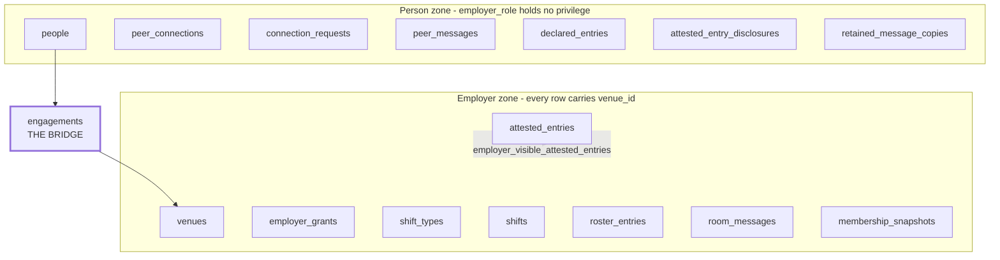
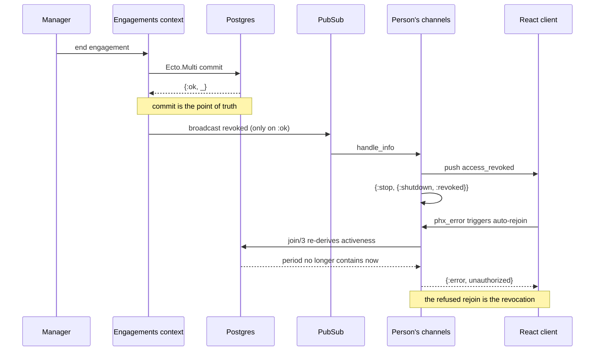

# feat: Worker-owned identity POC

## Summary

Build a greenfield Phoenix + React application in which a person record is the root of identity and an employer holds only a fixed-term engagement against it. The load-bearing work is a two-zone authorization boundary enforced by Postgres privileges rather than application convention, plus a membership model derived from time rather than stored as state. The deliverable is a demo that reaches a person holding zero engagements whose account still works.

---

## Problem Frame

The origin document's central claim is that an employer-scoped session must never resolve a peer conversation or a hidden profile entry, and that this must hold below the route layer. Everything else in the build is ordinary; that guarantee is not, and it is the reason the POC exists.

The research changed how to approach it. Standard multi-tenancy guidance assumes every row carries an `org_id` and the discipline is remembering to filter on it. This is the inverse — the forbidden tables have no employer key at all, so there is no filter to forget. That reframing converts the problem from "did anyone omit a `where` clause" into "does this connection hold the privilege," which is a question Postgres answers rather than one the codebase promises.

A second finding shapes the whole schema. Nothing may store whether an engagement is active. Any cached authorization decision reintroduces the exact failure the design exists to prevent — an expired grant that still works because nothing ran. Derived-from-time is not a preference here; it is what makes revocation correct even when the socket teardown fails.

The repository is empty apart from documentation, so every convention below is being established rather than followed.

---

## Key Technical Decisions

### The boundary

KTD1. **Four tiers, one guarantee.** Postgres role grants are the only tier whose violation produces an error rather than a leak. Above it sit capability separation at the transport, a fail-loud repo backstop, and scope structs for ergonomics. The plan names the grant tier as the guarantee and treats the rest as defence in depth — not because the upper tiers are worthless, but because calling a convention a guarantee is how this fails.

The rejected alternative worth naming is **Ash**. Its policy authorizer maps unusually well onto both halves of the requirement: filter policies return not-found rather than forbidden, defeating enumeration, and field policies rewrite filters on forbidden attributes so an employer cannot snoop by filtering on a hidden entry. It was rejected on two grounds. It remains in-BEAM — `authorize?: false` and bypass policies exist, so it is the strongest convention tier rather than a different tier. And adopting it is a whole-framework commitment on a POC whose stack decision is already made. If the grant tier were not available, Ash would be the recommendation.

KTD2. **Zone partition with exactly one bridge column, and the bridge is the only way to name a human.** Person-zone tables never carry an employer key. Employer-zone rows all carry `venue_id`. `engagements.person_id` is the only crossing. Critically, **no employer-zone table carries `person_id`** — messages, roster entries, and attested entries reference `engagements(id, venue_id)` instead. Without that rule the single-bridge claim is false, the erasure blast radius crosses the boundary in four places, and no worker's name is ever stored in an employer-zone row. Composite foreign keys with `match: :full` throughout, since repo-level scoping is not applied to joins. The zone test asserts mechanically that no employer-zone table holds a foreign key to `people`.

KTD3. **Hidden attested entries go through an owner-privileged view, not row-level security.** The employer role holds no privilege on the base table and reads a view owned by a privileged role that filters on a transaction-local setting. Row-level security would work but has to be `FORCE`d and must not run as table owner; a view has no equivalent switch to forget.

### Time

KTD4. **Never store `active`.** An engagement is a `tstzrange` with half-open `[)` bounds, and activeness is `period @> ^instant`. Half-open settles the boundary moment: no instant falls in two consecutive periods and none falls in a gap.

KTD5. **One instant per unit of work, carried on the scope.** The instant is computed in Elixir and passed as a bound parameter, never `fragment("now()")`. It is captured **once** at a unit-of-work boundary — an HTTP request, one inbound channel message, or one job attempt — and carried on the scope struct; `set_config('app.now', ...)` is set from the same value. Two sources of the same instant in one transaction would let the disclosure view call an entry concurrent while the access query called it expired. `Clock.now/0` is therefore callable from only three modules, enforced by the same check that bans `DateTime.utc_now/0` elsewhere.

The unit for a channel is the inbound event, not the join. A channel process lives for hours, so an instant stamped at join would authorise sends against a moment before the grace window opened — which is the demo's flagship beat.

KTD5b. **The injectable clock does not exist in production.** `Clock` delegates to a behaviour selected by config, and the offsettable implementation is configured only outside `:prod`. A demo control that can advance thirty days is also a control that can trigger irreversible retention deletion; making the override structurally absent from the production build is cheaper and stronger than guarding it. The demo database is disposable, and reset is a seed re-run.

KTD6. **Correctness is derived; liveness needs a sweeper.** An Oban job scheduled at the period's upper bound plus an idempotent periodic sweep, both calling the same revocation function. Not `Process.send_after` — it does not survive a deploy, and engagements outlive release cadence. If the sweeper is late the next request is still denied and only the open socket lingers, which is a bounded liveness bug rather than a data leak.

KTD6b. **Roster entries carry periods; there is no membership snapshot.** The earlier design materialised a shift room's membership at shift start so a later roster correction could not retroactively withdraw access. That inverts under its own failure mode — a job firing ten minutes late captures the roster *as corrected*, which is the exact retroactive withdrawal it existed to prevent, and its absence is indistinguishable from an empty roster so nothing can detect the miss.

Instead, roster entries carry a half-open period; removal sets the upper bound and never deletes the row. Shift-room read membership is `roster_entries.period && [starts_at, ends_at + grace)`. Non-retroactivity becomes structural — there is no write that can withdraw access — and the whole class of missed-job, double-run, and message-before-snapshot failures disappears along with the job. A GiST index on `(shift_id, engagement_id, period)` also gives a free exclusion constraint against double-rostering the same person across overlapping intervals of one shift.

It matters for the demo too: an injected clock advance does not make Oban jobs fire, so under the snapshot design the one thing the demo could not exercise was the room mechanism it exists to show.

### Realtime

KTD7. **Socket id is per session, not per person.** `"session:#{token_id}"`. The documented Phoenix example uses a per-user id, which here would kill the Venue A session when the Venue B engagement ends — violating origin R7 and AE1 directly.

KTD8. **`join/3` is the enforcement point; teardown is best effort.** The write commits first and the revocation broadcast fires only on success, because a broadcast inside the transaction disconnects clients for a change that may roll back. The JS client auto-rejoins on `phx_error`, so stopping a channel is a nudge and the rejoin refusal is the actual revocation.

KTD9. **Two socket modules, not one.** `PersonSocket` and `EmployerSocket` carry separate channel routing tables. `EmployerSocket` has no peer-conversation clause, so a join attempt fails in Phoenix's dispatch before any application code runs.

KTD10. **Peer conversations multiplex through one person-scoped channel.** `max_channels_per_transport` defaults to 100 as of Phoenix 1.8.9, and a multi-employer worker with venue rooms, shift rooms, and per-conversation channels can approach it. Multiplexing also keeps peer topics off employer sockets entirely.

### Scaffolding

KTD11. **Generate full-stack, then strip.** `mix phx.gen.auth` raises on a `--no-html` application. Generating the full stack and removing the HTML layer afterwards keeps the magic-link, sudo-mode, and token-table implementation verbatim, which is a meaningful amount of correct security code not worth reimplementing.

KTD12. **Binary IDs from the first generator invocation.** `AGENTS.md` requires `Ecto.UUID.t()` for every entity ID, and retrofitting is a migration across every table.

### Behaviours the origin left undefined

The flow analysis found seven behaviours with no defined answer. Each is resolved here rather than deferred, because every one of them changes what gets built.

KTD13. **"Active" means accepted and within the period.** Origin R3 and R5 disagree — R5 says an engagement becomes active on acceptance, R3 gives it a start date. Acceptance before the start date yields a confirmed-but-not-yet-active state granting no room access.

KTD14. **Closed shift rooms are snapshot-scoped; full-history read applies to the venue room only.** Origin R14 and R16 contradict each other. Taking R14 literally would let a day-one hire read every shift conversation the venue has ever held, which contradicts the document's own privacy posture.

KTD15. **Erasure pseudonymises the person row; it does not delete it.** Every referencing table forces a choice between `CASCADE` (destroying data the design commits to keeping) and `SET NULL` (destroying the constraints the design depends on — a null `person_id` drops an engagement out of overlap enforcement entirely). Neither is acceptable, so erasure sets `erased_at` and irreversibly overwrites the identifying columns in place. `engagements.person_id` stays non-null, the exclusion constraint keeps working, and the bridge foreign key is `ON DELETE RESTRICT` so an accidental delete raises rather than cascading across the boundary. Irreversible pseudonymisation is an accepted erasure implementation where the surrounding records have an independent basis for retention, and here it is the only implementation the schema can support.

The generated auth schema blocks this as it stands: `email` is non-null with a plain unique index. U2 changes it to a partial unique index scoped to un-erased rows, and erasure deletes auth tokens as an explicit step, since with no person delete there is no cascade to rely on.

KTD15b. **Message authorship resolves through the engagement.** Messages reference `author_engagement_id`, and the display label is a column on the engagement — which already carries the employer-authored role label. Erasure then reduces a number of rows proportional to engagements rather than to messages, no person's name is ever written into an employer-zone message row, and no read path has to remember a null-coalesce on the hottest query in the application.

KTD15c. **Erasure is identifier erasure, and the plan says so.** Message bodies survive because deleting them would destroy conversations belonging to other people. A body can still name someone. Bodies are retained on a legitimate-interest basis, and venue-room history — which has no deletion clock while the venue exists — therefore holds personal data indefinitely. That is a defensible position for a POC; leaving it unstated would not be.

KTD16. **Retention runs on materialised deadlines, not computed ones, across four triggers.** Own-message copies are keyed to that person's engagement end, shift history — messages *and* roster entries — to the shift, venue-room history to venue closure, and engagements and attested entries never, deliberately, because they are the person's portable record.

Each deadline is a stamped column written when the row is created, never a join against a mutable engagement period. Computing at sweep time would let a manager entering a backdated end date move a deletion deadline into the past and have the next unattended run destroy a worker's retained messages with no notice.

Retained own-message copies are physically separate person-zone rows, written inside the engagement-end transaction. If the archived area were a filtered view over the employer-zone message, one row would carry two deadlines and the shorter would silently win — a person whose engagement ended long after a shift would lose their own copy on the shift's clock.

KTD17. **Employer grants are seeded at venue creation, and the last-grant-holder invariant binds voluntary removal only.** Origin R44 ends every engagement a person holds, and a manager's authority derives from an engagement — so as specified the demo control can leave a venue nobody can administer. Voluntary grant removal and the demo control both refuse to remove the last one.

Erasure is exempt. Gating a data-subject right on an operational convenience is the wrong trade, and the failure would be silent from the requester's side. Erasing a venue's sole grant-holder succeeds and leaves the venue in an explicit orphaned state with an operator re-seed path.

KTD18. **Suspension affects the venue room only, is reversible at will, and is invisible to the employer.** Origin R11 is one sentence carrying the document's central privacy claim. Employer visibility of the flag would make it a retaliation surface rather than an opt-out, which is the shape of the case the Problem Frame cites.

KTD19. **"Fresh acceptance" is directional.** After a decline or a disconnect, only the non-blocked party may send the next request, and the block survives new co-rostering. Read symmetrically the phrase makes Declined an absorbing state, and disconnection is the origin's only stated remedy for harm.

KTD20. **Engagement end is end-of-day in the venue's timezone.** Venues carry an IANA zone as part of their minimum details. Close shifts cross midnight routinely, so a date-boundary expiry makes mid-shift expiry the normal case rather than the exotic one.

### Repository conventions

KTD21. **Deletion is confined to the lifecycle context.** Erasure and the retention sweeper are the only operations that remove rows; every other context ends or reduces records rather than deleting them. This is containment, not a soft-delete policy — it keeps the two operations that can destroy data findable in one module, which matters because one of them runs unattended on a schedule.

---

## High-Level Technical Design

### Zone partition and the single bridge

The employer role's grants are the guarantee: `REVOKE ALL ON` every person-zone table. A forgotten filter surfaces as `permission denied for table peer_messages` rather than as a leak. `attested_entries` sits in the employer zone but is read by the employer only through the view, because the hidden-entry rule is per-row and grants cannot express it.

### Revocation ordering

---

## Requirements

**Identity and engagement**

- R1. A person record is created only by the person; an employer action produces at most an invitation, and an unclaimed invitation creates no record. (origin R1, R2, R5)
- R2. Engagements are fixed-term with no open-ended form, stored as a half-open period, with activeness derived at query time. (origin R3, R4)
- R3. A person cannot hold two overlapping engagements at the same venue, enforced by a database exclusion constraint. (origin R3)
- R4. Ending an engagement revokes room access at the venue immediately and leaves every other venue untouched. (origin R6, R7)

**The boundary**

- R5. The application connects through two Postgres roles, and the employer role holds no read privilege on any person-zone table. (origin R24, R42)
- R6. An employer-scoped session cannot resolve a peer conversation through any transport, query, or subscription path. (origin R24, R42)
- R7. Attested entries a person has hidden from an employer are unreachable by that employer's session, enforced by an owner-privileged view rather than by omitting an endpoint. (origin R29, R42)
- R8. A test asserts the absence of the privilege itself, and a second test fails when any new schema is left unclassified. (origin AE6)

**Rooms and membership**

- R9. Venue-room membership is bounded by active engagements and is suspendable by the person alone. (origin R10, R11)
- R10. Shift-room membership is the set of roster entries whose period overlaps the room's open interval; removal closes a period and never withdraws access to messages already sent. (origin R12, R13, KTD6b)
- R11. A shift room accepts messages until a grace period defined by its shift type, then remains readable to everyone whose roster period overlapped its open interval. (origin R15, R16, KTD14)
- R12. Room state transitions are visible to the worker, and a rejected send surfaces an explicit message. (origin R17)

**Peer graph**

- R13. Co-rostering creates visibility that persists thirty days past engagement end; a permanent connection requires request and acceptance. (origin R18, R19, R20)
- R14. Connection requests carry pending, declined, and expired states, with re-request blocked directionally after a decline or a disconnect. (origin R21, R23, KTD19)
- R15. Peer conversation is 1:1, multiplexed through the person socket, and revocable by either party. (origin R23, R24)

**Profile and lifecycle**

- R16. Attested entries are employer-asserted and person-uneditable, carry an employer-authored role label, and accept worker correction requests. (origin R25, R26, R27)
- R17. Per-employer and per-peer disclosure is worker-controlled, with concurrent engagements hidden by default derived from period overlap rather than materialised. (origin R29, R30, R31)
- R18. Erasure ends all engagements and pseudonymises the person record in place, reducing attested entries and authorship labels without deleting the person row. (origin R33, R34, KTD15)
- R19. Retention deletion runs on four triggers against stamped deadlines, under a blast-radius ceiling, with every run recorded. (origin R35, KTD16)

**Demonstration**

- R20. A single injectable clock reaches every time-dependent behaviour, including the grace window, the thirty-day lapse, and retention deletion. (origin R43, R44, KTD5)
- R21. Seed data reaches every state the success criteria require, including an accepted peer connection with messages and a person holding zero engagements. (origin R45)
- R22. The demo control refuses to end a venue's last grant-holding engagement. (KTD17)

---

## Implementation Units

Twelve units, above the usual range because this is greenfield — every unit below would otherwise be an assumed foundation. They are grouped into four phases; within a phase, units may land in any dependency-respecting order.

`AGENTS.md` mandates a pre-implementation test design gate that produces a brief, writes tests only, confirms a test fails for the expected reason, and stops for human approval. The skill it names (`.claude/skills/test-design/SKILL.md`) is not present in the repository, so each unit below carries the posture as an execution note and the gate runs manually until that skill exists.

### Phase A — Foundation and the boundary

#### U1. Scaffold, toolchain, and clock authority

- **Goal:** A running Phoenix application with pinned toolchain, binary IDs, both Postgres roles created, and a single clock module every time-dependent query reads from.
- **Requirements:** R20
- **Dependencies:** none
- **Files:** `mix.exs`, `.tool-versions`, `config/config.exs`, `config/dev.exs`, `config/test.exs`, `lib/hospitality_coms/clock.ex`, `lib/hospitality_coms/repo.ex`, `lib/hospitality_coms/employer_repo.ex`, `priv/repo/migrations/*_create_roles.exs`, `test/hospitality_coms/clock_test.exs`
- **Approach:** Generate with `mix phx.new hospitality_coms --binary-id --database postgres`, keeping HTML for now (U2 depends on it). Pin Elixir 1.20.2 and OTP 29; the local toolchain is on 1.19.5, which is security-patches-only. Create `employer_role` and `person_role` in a migration and configure two repos. `Clock` exposes the current instant and is the only module permitted to produce one — a Credo check bans `DateTime.utc_now/0` elsewhere. `mix phx.new` generates its own `AGENTS.md`; preserve the existing file.
- **Execution note:** Test-design gate applies; write the Credo check's failing case before the check.
- **Patterns to follow:** none exist yet — this unit establishes them.
- **Test scenarios:**
  - `Clock.now/0` returns a `DateTime` with microsecond precision.
  - The test clock, when set to a fixed instant, returns that instant on repeated calls.
  - Advancing the test clock by a duration moves the returned instant by exactly that duration.
  - The custom Credo check flags a module calling `DateTime.utc_now/0` outside `Clock`.
  - The custom Credo check does not flag `Clock` itself.
  - Migrating up then down leaves no `employer_role` in `pg_roles`.
- **Verification:** `mix compile --warnings-as-errors` passes, both repos connect, and `mix quality` runs clean.

#### U2. Person identity and magic-link authentication

- **Goal:** A person can register and authenticate with no employer involved, and the HTML layer is removed afterwards.
- **Requirements:** R1
- **Dependencies:** U1
- **Files:** `lib/hospitality_coms/accounts.ex`, `lib/hospitality_coms/accounts/person.ex`, `lib/hospitality_coms/accounts/person_token.ex`, `lib/hospitality_coms/accounts/scope.ex`, `lib/hospitality_coms_web/person_auth.ex`, `lib/hospitality_coms_web/controllers/session_controller.ex`, `priv/repo/migrations/*_create_people_auth_tables.exs`, `test/hospitality_coms/accounts_test.exs`, `test/hospitality_coms_web/person_auth_test.exs`
- **Approach:** Run `mix phx.gen.auth Accounts Person people` while HTML is still present, then strip the generated HTML controllers, templates, and LiveView deps. Magic-link-first with sudo mode is the Phoenix 1.8 default and fits self-registration with no corporate email. Adapt the generated session controller to return a token as JSON per the framework's API authentication guide, reusing the token table rather than introducing a second mechanism — a database-backed token is revocable, which a signed stateless token is not.
- **Execution note:** Do not hand-roll token logic. Copy the generated implementation and adapt only the response shape.
- **Patterns to follow:** the generated `Scope` struct, extended in U3.
- **Test scenarios:**
  - Requesting a magic link for an unknown address creates a person and a token.
  - A valid magic-link token authenticates and returns an API token.
  - A magic-link token cannot be redeemed twice.
  - An expired magic-link token is rejected.
  - An API token whose person has since changed email no longer verifies.
  - Deleting a token row immediately invalidates the corresponding session.
  - No employer-side code path can create a person record.
- **Verification:** A person registers and authenticates end to end with no venue existing in the database.

#### U3. The two-role boundary and its proof suite

- **Goal:** The employer role cannot read person-zone tables, and tests assert the absence of the privilege rather than the presence of an error response.
- **Requirements:** R5, R6, R7, R8 (origin AE6)
- **Dependencies:** U1, U2
- **Files:** `lib/hospitality_coms/zones.ex`, `lib/hospitality_coms/employer_repo.ex`, `lib/hospitality_coms/accounts/employer_scope.ex`, `lib/hospitality_coms/accounts/person_scope.ex`, `priv/repo/migrations/*_grant_zones.exs`, `test/hospitality_coms/boundary_test.exs`, `test/hospitality_coms/zones_test.exs`
- **Approach:** `Zones` classifies every schema into person zone, employer zone, or shared. The grant migration revokes all privileges on person-zone tables from `employer_role`. `EmployerRepo` wraps reads in a transaction that sets `app.employer_id` and `app.now` transaction-locally, because a non-local setting leaks across a pooled connection. Add a `prepare_query/3` backstop that walks the query's sources and raises when an employer scope touches a person-zone table — this catches the failure inside the BEAM with a clear message before Postgres produces a less legible one. Two scope structs rather than one, so a person-zone context function refuses an employer scope by function clause rather than by runtime check.
- **Execution note:** Write the privilege assertion first. It should fail before the grant migration exists.
- **Patterns to follow:** the composite-foreign-key discipline from U4 onward relies on this unit's zone classification.
- **Test scenarios:**
  - `has_table_privilege('employer_role', t, 'SELECT')` is false for every person-zone table.
  - Every Ecto schema in the application appears in exactly one zone; an unclassified schema fails the test.
  - `EmployerRepo` querying a person-zone table raises before reaching Postgres.
  - A person-zone context function called with an employer scope raises `FunctionClauseError`.
  - An employer-scoped read outside a transaction raises rather than running unscoped.
  - No employer-zone table holds a foreign key to `people`.
  - Selecting from the employer-visible view outside the wrapper raises rather than returning an empty set.
  - Rolling the grant migration back and forward leaves privileges in the same state.

  The transaction-local setting's lifetime is asserted against a non-sandboxed connection in a synchronous test. Inside the sandbox, `EmployerRepo`'s transaction is a savepoint within the test's own transaction, so the setting survives a successful inner commit and the production behaviour is not reproduced — asserting it there would either fail or get weakened until it passed, and weakening it removes one of the boundary's proof points.
- **Verification:** The proof suite passes, and manually granting `SELECT` on a person-zone table to `employer_role` makes it fail.

### Phase B — Domain and realtime

#### U4. Employer zone: venues, grants, shift types

- **Goal:** A venue exists with a timezone, at least one grant-holder, and shift types carrying grace periods.
- **Requirements:** R22 (origin F1)
- **Dependencies:** U3
- **Files:** `lib/hospitality_coms/venues.ex`, `lib/hospitality_coms/venues/venue.ex`, `lib/hospitality_coms/venues/employer_grant.ex`, `lib/hospitality_coms/venues/shift_type.ex`, `priv/repo/migrations/*_create_venues.exs`, `test/hospitality_coms/venues_test.exs`
- **Approach:** Venues carry an IANA timezone as a required field per KTD20. Grants are seeded at venue creation, which resolves the bootstrap circularity in the origin document — a venue cannot exist without one. Enforce the last-grant-holder invariant in the context, not only in the demo control, so no path can reach an unadministrable venue.
- **Execution note:** Test-design gate applies.
- **Patterns to follow:** composite unique index on `(id, venue_id)` for every table other rows will reference, per KTD2.
- **Test scenarios:**
  - Creating a venue without a timezone is rejected.
  - Creating a venue seeds exactly one grant for the creating person.
  - Removing the last grant from a venue is rejected.
  - Removing a grant when two exist succeeds.
  - A shift type with a grace period above two hours is rejected.
  - A shift type with a zero grace period is accepted.
  - A shift type cannot be attached to a venue the session does not hold a grant for.
- **Verification:** A venue with two shift types and one grant-holder exists and is readable only through its own employer scope.

#### U5. Engagement lifecycle

- **Goal:** Invitation, claim, fixed-term period, derived activeness, renewal, and the scheduled revocation that follows expiry.
- **Requirements:** R1, R2, R3, R4 (origin F2, F3, AE1)
- **Dependencies:** U4
- **Files:** `lib/hospitality_coms/engagements.ex`, `lib/hospitality_coms/engagements/engagement.ex`, `lib/hospitality_coms/engagements/invitation.ex`, `lib/hospitality_coms/engagements/records.ex`, `lib/hospitality_coms/workers/expire_engagement.ex`, `lib/hospitality_coms/workers/engagement_sweeper.ex`, `priv/repo/migrations/*_create_engagements.exs`, `test/hospitality_coms/engagements_test.exs`, `test/hospitality_coms/workers/engagement_sweeper_test.exs`
- **Approach:** The period is a `tstzrange` with half-open bounds and a named `btree_gist` exclusion constraint on `(person_id, venue_id, period)`, with the extension created in its own earlier migration. Name the constraint explicitly and declare a matching `exclusion_constraint/3`, or the violation raises through the transaction instead of returning a tuple and the enumerated-error convention is a lie.

  The exclusion constraint is not the interesting race. Two people claiming the same invitation produce engagements with *different* people, so nothing overlaps and nothing fires. Guard it with a unique index on `engagements.invitation_id` and consume the invitation as a conditional update requiring exactly one affected row, as the **first** step of the Multi — the loser then matches zero rows and fails cleanly with a step name. Attested-entry creation belongs in that same Multi; a crash between them would leave an engagement with no portable history, which is the product.

  Renewal mutates the period's upper bound, and a row does not conflict with itself, so two concurrent renewals are a silent lost update on the authorization root. Add `optimistic_lock`. The expiry worker must perform **no write** to engagements — it re-derives activeness and broadcasts only when false, because a stale job from before a renewal would otherwise truncate a renewed period.

  Invitations carry a single-use opaque claim code and no stored contact identifier. `Records` owns every query and exposes `active_at/2` taking the instant explicitly.
- **Execution note:** Write the exclusion-constraint violation test and the concurrent-claim test before the migration.
- **Patterns to follow:** `Ecto.Multi` for the claim, which creates the engagement and consumes the invitation atomically.
- **Test scenarios:**
  - An unclaimed invitation grants no access and creates no person record.
  - Claiming an invitation attaches an engagement to the claiming person's existing record.
  - A claim code cannot be redeemed twice.
  - Two concurrent claims of the same code produce exactly one engagement, and the loser fails with a named step.
  - An expired claim code is rejected.
  - Claiming creates the attested entry in the same transaction; a failure after the engagement insert leaves neither.
  - An exclusion-constraint violation returns an error tuple rather than raising.
  - Two concurrent renewals do not silently discard one extension.
  - An expiry job firing after a renewal leaves the engagement untouched.
  - Two overlapping engagements for the same person and venue are rejected by the constraint.
  - Two adjacent engagements sharing an instant at the boundary are accepted, confirming half-open bounds.
  - An engagement accepted before its start date is not active at the acceptance instant.
  - `active_at/2` at the period's lower bound returns the engagement; at the upper bound it does not.
  - Renewal extends the same engagement and produces one attested entry, not two.
  - The sweeper running twice over the same expired engagement produces one revocation.
  - Ending an engagement at Venue B leaves the Venue A engagement active.
- **Verification:** Advancing the injected clock past an engagement's upper bound makes every membership query exclude that person with no job having run.

#### U6. Rooms and derived membership

- **Goal:** A venue room bounded by active engagements, shift rooms snapshotted at start, grace windows, and the read scope resolved in KTD14.
- **Requirements:** R9, R10, R11 (origin F4, AE2, AE5)
- **Dependencies:** U5
- **Files:** `lib/hospitality_coms/rooms.ex`, `lib/hospitality_coms/rooms/venue_room.ex`, `lib/hospitality_coms/rooms/shift_room.ex`, `lib/hospitality_coms/rooms/records.ex`, `lib/hospitality_coms/rosters.ex`, `lib/hospitality_coms/rosters/roster_entry.ex`, `priv/repo/migrations/*_create_rooms.exs`, `priv/repo/migrations/*_create_roster_entries.exs`, `test/hospitality_coms/rooms_test.exs`, `test/hospitality_coms/rosters_test.exs`
- **Approach:** Venue-room membership is a query over active engagements minus suspensions. Shift-room membership is roster entries whose period overlaps the room's open interval, per KTD6b — nothing is materialised and no job runs. Removal closes a period rather than deleting a row, so access already granted cannot be withdrawn by a later correction. Post-grace readability is that same overlap intersected with an active engagement, which resolves the origin's R14/R16 contradiction and its deferred question about a person rostered into a room still in grace.
- **Execution note:** Test-design gate applies; the period-overlap predicate is the highest-risk logic in this unit and every boundary case below should fail before it exists.
- **Patterns to follow:** `Records` query modules from U5.
- **Test scenarios:**
  - A person with an active engagement is in the venue room; one whose engagement ended is not.
  - A suspended person is absent from the venue room but remains in shift rooms.
  - A suspended person can resume and sees full history including messages sent while suspended.
  - The employer scope cannot read the suspension flag.
  - A shift room's membership at open equals the rostered set with active engagements.
  - Adding a person to the roster after open adds them to the room and keeps them readable after grace closes.
  - Removing a person from the roster after open leaves their access to already-sent messages intact.
  - A person rostered before the shift and removed before it starts never appears in the room.
  - The same person cannot hold two overlapping roster periods on one shift.
  - A post-grace send is rejected; a within-grace send is accepted.
  - A shift-type grace of zero closes the room at shift end.
  - A person outside the snapshot cannot read the closed shift room even with an active engagement.
  - A newly engaged person can read venue-room history predating their engagement.
  - A newly engaged person cannot read closed shift rooms from before their engagement.
- **Verification:** Advancing the clock across a shift end and then across its grace boundary changes send behaviour without any job running.

#### U7. Realtime transport and revocation

- **Goal:** Two sockets, channel join authorization, and revocation whose enforcement is the refused rejoin.
- **Requirements:** R4, R6, R12 (origin F3, AE1)
- **Dependencies:** U6
- **Files:** `lib/hospitality_coms_web/channels/person_socket.ex`, `lib/hospitality_coms_web/channels/employer_socket.ex`, `lib/hospitality_coms_web/channels/venue_room_channel.ex`, `lib/hospitality_coms_web/channels/shift_room_channel.ex`, `lib/hospitality_coms_web/channels/presence.ex`, `lib/hospitality_coms/pub_sub.ex`, `test/hospitality_coms_web/channels/venue_room_channel_test.exs`, `test/hospitality_coms_web/channels/revocation_test.exs`
- **Approach:** Declare both sockets with `auth_token: true` so the token travels in the `Sec-WebSocket-Protocol` header rather than a query parameter that lands in access logs. `EmployerSocket` declares no peer topics. Route every subscription through a `PubSub` module whose clauses key on scope struct, so an employer scope subscribing to a peer topic is a `FunctionClauseError` rather than a silent delivery. Revocation broadcasts only after commit, pushes a terminal event, then stops the channel — and `join/3` re-derives activeness so the automatic rejoin is refused.
- **Execution note:** The revocation test must assert the rejoin is refused. A test that only asserts the channel process died is testing the nudge, not the guarantee.
- **Patterns to follow:** `import Phoenix.ChannelTest`, not `use` — the latter is deprecated.
- **Test scenarios:**
  - Joining a venue room with an active engagement succeeds.
  - Joining a venue room after the engagement ends is refused.
  - Joining a peer topic on the employer socket fails as an unmatched topic.
  - An employer scope passed to the subscription module raises `FunctionClauseError`.
  - Ending an engagement stops the person's channels for that venue.
  - After that stop, the client's automatic rejoin is refused.
  - Ending a Venue B engagement leaves the Venue A channel joined and functional.
  - A rolled-back engagement change produces no revocation broadcast.
  - Presence emits a leave when a revoked channel stops, without an explicit untrack.
  - Presence fetcher processes are drained on test exit without an owner-exited error.
- **Verification:** With two browser sessions open, ending one engagement drops one venue's rooms live and leaves the other's untouched.

### Phase C — Worker surfaces

#### U8. Peer graph

- **Goal:** Co-rostered visibility with a thirty-day tail, the full request state machine, 1:1 conversations, and unilateral disconnect.
- **Requirements:** R13, R14, R15 (origin F5, F6, AE3)
- **Dependencies:** U6, U7
- **Files:** `lib/hospitality_coms/peers.ex`, `lib/hospitality_coms/peers/visibility.ex`, `lib/hospitality_coms/peers/connection_request.ex`, `lib/hospitality_coms/peers/connection.ex`, `lib/hospitality_coms/peers/conversation.ex`, `lib/hospitality_coms/peers/records.ex`, `priv/repo/migrations/*_create_peer_graph.exs`, `test/hospitality_coms/peers_test.exs`
- **Approach:** Visibility is a derived interval per pair per venue, not a stored flag, with the tail starting at the first of the two engagements to end. Conversations multiplex through the person channel per KTD10. The directional block from KTD19 is stored on the connection request as a blocked-initiator column so it survives new co-rostering.
- **Execution note:** Test-design gate applies; the state machine is the densest logic in the build.
- **Patterns to follow:** person-zone classification from U3 — none of these tables carry a venue key.
- **Test scenarios:**
  - Co-rostering creates visibility between two people.
  - Visibility persists twenty-nine days after an engagement ends and lapses at thirty-one.
  - A pending request expires when visibility lapses, and the requester is told it lapsed.
  - A declined request cannot be re-sent by the decliner's counterpart.
  - The declining party can themselves initiate a request.
  - The block survives the pair being co-rostered again at a different venue.
  - Accepting a request creates a connection readable by both.
  - A connection survives both engagements ending.
  - Either party can disconnect; the conversation closes for both.
  - After disconnect each party retains a readable copy of their own messages.
  - The disconnected party cannot re-request without fresh acceptance.
  - Simultaneous crossed requests resolve to one connection, not two.
  - An employer-scoped session cannot resolve a conversation between two of its own staff.
- **Verification:** The boundary suite from U3 still passes with the peer tables populated.

#### U9. Profile, disclosure, and the employer-visible view

- **Goal:** Attested and declared entries, per-employer and per-peer disclosure, correction requests, and the view the employer role reads through.
- **Requirements:** R7, R16, R17 (origin AE4)
- **Dependencies:** U5, U8
- **Files:** `lib/hospitality_coms/profiles.ex`, `lib/hospitality_coms/profiles/attested_entry.ex`, `lib/hospitality_coms/profiles/declared_entry.ex`, `lib/hospitality_coms/profiles/disclosure.ex`, `lib/hospitality_coms/profiles/correction_request.ex`, `priv/repo/migrations/*_create_profiles.exs`, `priv/repo/migrations/*_create_employer_visible_view.exs`, `test/hospitality_coms/profiles_test.exs`
- **Approach:** Attested entries derive from engagements and are never written directly. The concurrency default is computed from period overlap inside the view rather than materialised as disclosure rows, so changing an engagement's dates corrects the default automatically. The standing incompleteness notice is a UI constant, not a computed flag — computing "are any hidden" would turn the notice into an oracle.
- **Execution note:** Test-design gate applies.
- **Patterns to follow:** the view-not-RLS decision in KTD3.
- **Test scenarios:**
  - An attested entry appears when an engagement is created and carries its role label.
  - A person cannot edit an attested entry.
  - A concurrent engagement at another venue is absent from the view for the viewing employer.
  - A non-concurrent past engagement is present in the view by default.
  - A hidden entry remains hidden after it stops being concurrent.
  - Revoking a disclosure removes the entry from the view within the same transaction.
  - The employer role cannot select from the base attested-entries table.
  - A correction request is visible alongside the entry to any viewer of it.
  - Declining a correction request leaves both the entry and the request visible.
  - A peer sees entries per the peer setting, independent of the employer setting.
- **Verification:** A manager's employer session and the same human's person session return different entry sets for the same worker.

#### U10. Data lifecycle

- **Goal:** Erasure, the three retention clocks, and the documented hard-delete exception.
- **Requirements:** R18, R19
- **Dependencies:** U9
- **Files:** `lib/hospitality_coms/lifecycle.ex`, `lib/hospitality_coms/workers/retention_sweeper.ex`, `priv/repo/migrations/*_add_retention_columns.exs`, `test/hospitality_coms/lifecycle_test.exs`, `test/hospitality_coms/workers/retention_sweeper_test.exs`
- **Approach:** Erasure runs as one `Ecto.Multi` that ends all engagements, pseudonymises the person row in place per KTD15, reduces engagement labels, deletes auth tokens explicitly, suppresses retained-copy creation for the engagements it is ending, and cancels that person's scheduled jobs by deleting the rows in the same transaction. It is exempt from the last-grant-holder invariant per KTD17. Erasing a peer conversation is a disconnect plus deletion of the erased person's own messages — the survivor keeps their own copy under a non-identifying counterpart label, because the erasing party has no claim over the other person's words. That is the same reasoning KTD15c uses for room messages, applied consistently.

  The retention sweeper reads stamped `delete_after` columns rather than joining a mutable period, deletes in bounded batches, rolls back if the count exceeds a configured ceiling, and records each run with the instant used and per-trigger counts. An unattended deleter driven by an injectable input needs both a limit and a trace.
- **Execution note:** Test-design gate applies. Deletion is irreversible here, so the failing test comes first without exception.
- **Patterns to follow:** `Ecto.Multi` with named steps, per the repository's write conventions.
- **Test scenarios:**
  - Erasure with a live engagement ends that engagement in the same transaction.
  - Erasure leaves the person row present, pseudonymised, with `erased_at` set.
  - Two erased people do not collide on the email unique index.
  - An erased person cannot authenticate; their tokens are gone.
  - Erasure of a venue's sole grant-holder succeeds and leaves the venue orphaned.
  - Messages authored by an erased person remain readable with a non-identifying label.
  - Erasure of a peer conversation leaves the survivor their own messages.
  - Erasure cancels that person's scheduled expiry and retention jobs.
  - Own-message copies are deleted on their stamped deadline, unaffected by a later backdated engagement end.
  - Shift history — messages and roster entries — is deleted on the shift's clock, not any engagement's.
  - Venue-room history survives the sweeper and is deleted only on venue closure.
  - The sweeper deletes nothing whose deadline is exactly the current instant, matching the half-open convention.
  - The sweeper rolls back when the batch exceeds the configured ceiling.
  - Each run writes a record with the instant used and per-trigger counts.
  - No context module outside `Lifecycle` calls `Repo.delete` or `Repo.delete_all`.
- **Verification:** Advancing the clock past a retention boundary and running the sweeper deletes exactly the expected rows.

### Phase D — Demo

#### U11. Seed manifest and demo controls

- **Goal:** Seed data that reaches every state the success criteria require, and controls that traverse every duration.
- **Requirements:** R20, R21, R22 (origin AE7)
- **Dependencies:** U10
- **Files:** `priv/repo/seeds.exs`, `lib/hospitality_coms/demo.ex`, `lib/hospitality_coms_web/controllers/demo_controller.ex`, `test/hospitality_coms/demo_test.exs`
- **Approach:** The origin's seed requirement is insufficient — watching a peer conversation survive needs a pre-existing accepted connection, which needs a co-rostered shift, a shift type, a roster, and messages, none of which it names. Seed two employers, four people, two shift types with differing graces, a past roster, a live shift, a closed shift, an accepted connection with messages, a pending request, and a hidden concurrent entry. The clock control advances the injected instant globally, which is what makes the grace window, the thirty-day lapse, and the retention boundary reachable. Demo controls run under their own scope, not an employer scope, because ending engagements across employers is something no employer session may do.
- **Execution note:** Test-design gate applies.
- **Patterns to follow:** the `Clock` module from U1 is the only injection point.
- **Test scenarios:**
  - Seeding produces a person holding concurrent engagements at both employers.
  - Seeding produces an accepted peer connection with at least two messages.
  - A clock advance followed by the run-due-work action produces the expected retention deletion; the advance alone does not.
  - The clock override is unavailable in a production build.
  - Advancing the clock past a shift's grace boundary closes that room.
  - Advancing the clock thirty-one days past an engagement end lapses visibility.
  - Ending every engagement a person holds leaves their profile and conversations functional.
  - The control refuses to end a venue's last grant-holding engagement.
  - Demo controls are unreachable from an employer-scoped session.
  - Seeds are idempotent when run twice.
- **Verification:** Every success criterion in the origin document is reachable from a freshly seeded database without editing rows by hand.

#### U12. React client

- **Goal:** A web client covering both payoff moments and the surfaces the earlier units expose.
- **Requirements:** R12, R15, R17
- **Dependencies:** U7, U8, U9, U11
- **Files:** `client/src/api/`, `client/src/socket/`, `client/src/features/rooms/`, `client/src/features/peers/`, `client/src/features/profile/`, `client/package.json`, `client/src/**/*.test.tsx`
- **Approach:** Separate `client/` directory rather than the asset pipeline, since the backend is API-only after U2's strip. Pin the `phoenix` npm package at 1.8.9 or above — earlier versions carry a Presence client crash on keys colliding with `Object.prototype` members. Handle the terminal revocation event by leaving the topic rather than letting the client retry into a refusal loop. This is the coarsest unit in the plan and will likely split during execution once the surface count is real.
- **Execution note:** Test-design gate applies per surface, not per unit.
- **Patterns to follow:** none — establishes the client conventions.
- **Test scenarios:**
  - A closed room renders its state and disables the composer.
  - A rejected send surfaces an explicit message rather than failing silently.
  - Receiving the revocation event removes the room from the list without a retry loop.
  - The archived-engagements area renders own messages only and is visually distinct from a read-only current room.
  - Each attested entry renders its current audience.
  - Changing a disclosure setting confirms the new state.
  - A pending outbound request renders as pending until answered.
  - Two workers exchanging peer messages see them in order.
- **Verification:** Both payoff moments run end to end in a browser without narration.

---

## Acceptance Examples

The origin document's seven acceptance examples carry forward unchanged and are covered by the test scenarios above. One is restated here because it is the plan's load-bearing test and its shape changed with KTD1.

- AE1. The boundary refuses below the interface
  - **Given** a manager authenticated for one venue and the identifier of a peer conversation between two of its staff
  - **When** the manager's session issues a direct query for it
  - **Then** Postgres refuses for want of privilege, the transport has no route to the topic, and the HTTP surface returns not-found rather than forbidden
  - **Covers R5, R6, R8.** Origin AE6.

The not-found rather than forbidden detail matters: a forbidden response confirms the conversation exists.

---

## Scope Boundaries

### Deferred for later

Carried from the origin document: mobile clients, integration with any real scheduling or HR system, verification that a venue or employer is real, matching or comparing workers on role, cross-venue mutual aid, worker-owned availability, place-anchored threads, WhatsApp export import, offline behaviour, rich messaging, and standing sub-venue groups.

### Deferred to follow-up work

Plan-local sequencing rather than product boundaries:

- Pagination on room history. Every list that grows needs it per `AGENTS.md`; the seeded volume does not require it to demonstrate anything.
- A `CONCEPTS.md` glossary. `AGENTS.md` references it and it does not exist; creating it is owned by a different workflow.
- Telemetry and structured logging. `AGENTS.md` describes a logging module belonging to another codebase, so the surface has to be built rather than called.
- Splitting U12 by client surface once the real surface count is known.

### Outside this product's identity

Carried verbatim from the origin: employer visibility into peer conversation, any rating or ranking of a worker, and a qualification taxonomy.

---

## System-Wide Impact

There is no existing system to disturb, so the impact runs the other way: several decisions here become standing constraints that every future unit inherits, and each has a test that fails when it is violated rather than a convention that erodes quietly.

- **Every new schema must be classified into a zone.** The totality test in U3 fails on any unclassified schema, so adding a table is not complete until someone has decided which side of the boundary it sits on. This is the single most important constraint in the build and the one most likely to be forgotten under time pressure.
- **No module outside `Clock` may produce an instant.** A Credo check enforces it. Every time-dependent query takes the instant as a parameter, which is what makes shift-boundary behaviour testable and what makes the demo controls work at all.
- **Every context function takes a scope and refuses the wrong one by function clause.** Two structs rather than one, so the refusal is a compile-shaped failure rather than a runtime check someone can forget to write.
- **Employer reads run inside the transaction wrapper.** The transaction-local settings the view depends on require it. A read reaching `EmployerRepo` outside the wrapper fails closed, so this surfaces as a broken feature rather than a leak — but it does surface.
- **The snapshot is the only stored membership in the system.** Any future room type must decide derived-versus-snapshot deliberately and record why, because the default everywhere else is derived.
- **Deletion lives only in `Lifecycle`.** A test asserts no other context calls it.
- **Dialyzer gates CI and every public function carries a `@spec` with enumerated error atoms.** This is a repository convention rather than a plan decision, but it shapes every unit's definition of done.

---

## Risks and Dependencies

- **The toolchain is behind.** The local Elixir is 1.19.5, which moved to security-patches-only when 1.20 shipped. U1 pins forward; if that is deferred, the type inference the plan assumes is absent.
- **Employer reads must run in a transaction.** The transaction-local setting the view depends on requires it. A read that escapes the wrapper fails closed rather than leaking, but it fails — so the wrapper has to be the only way to reach `EmployerRepo`.
- **The sandbox and transaction-local settings interact.** Tests already run inside a sandbox transaction, so a setting scoped to it persists for the whole test rather than one query. Test lifetimes will not match production lifetimes; assert the setting's absence explicitly rather than assuming it cleared.
- **PubSub is global across async tests.** Two async tests broadcasting on the same literal topic will see each other's messages. Namespace topics by fixture-generated identifiers.
- **The test-design gate has no skill behind it.** `AGENTS.md` mandates a gate that stops for human approval and names a skill path that does not exist. Until it does, the gate is manual, which makes it the most likely convention to erode.
- **Dialyzer on a greenfield tree is slow to first green.** The PLT build is a one-time cost that lands in U1 and will feel disproportionate there.

---

## Open Questions

- Whether the twenty-four-month retention period is the right value. Carried from the origin; the plan implements it as configuration so the number is cheap to change.
- Whether a venue manager may form peer connections with staff they roster. Carried from the origin. It is not blocking — the boundary holds either way because the person session and the employer session are distinct principals — but it determines whether the manager's personal session can see entries hidden from their employer session, which is worth deciding before U9 ships.
- Whether shift types belong to a venue or are shared across an employer's venues. The plan assumes per-venue, which is the narrower choice and the easier one to widen.

---

## Sources and Research

- `docs/brainstorms/2026-07-26-worker-owned-identity-requirements.md` — origin document, including the scope boundaries and acceptance examples carried forward.
- `docs/ideation/2026-07-26-hospitality-worker-comms-ideation.html` — the ranked candidate set this direction was selected from, with the rejected alternatives and their reasons.
- [Phoenix: Scopes](https://hexdocs.pm/phoenix/scopes.html) and [API Authentication](https://hexdocs.pm/phoenix/api_authentication.html) — the framework's own position on data-layer scoping and on reusing the token table for API sessions.
- [Ecto: Multi tenancy with foreign keys](https://hexdocs.pm/ecto/multi-tenancy-with-foreign-keys.html) — the composite-foreign-key discipline in KTD2, and the observation that non-tenant data belongs in a separate prefix or database, which is the origin of KTD1.
- [Phoenix.Socket](https://hexdocs.pm/phoenix/Phoenix.Socket.html) and [Phoenix.Channel](https://hexdocs.pm/phoenix/Phoenix.Channel.html) — `id/1` for forced disconnect, and the absence of any per-channel revoke API, which is why KTD8 makes `join/3` the enforcement point.
- [Bytebase: Postgres row-level security footguns](https://www.bytebase.com/blog/postgres-row-level-security-footguns/) — the owner-bypass and pooling failures behind KTD3's preference for a view.
- [FHIR R5: PractitionerRole](http://hl7.org/fhir/practitionerrole.html) — the closest structural prior art for person-separate-from-role-at-organization-over-a-period.
- Phoenix 1.8.9 release notes — `max_channels_per_transport` defaulting to 100, which constrains KTD10.
