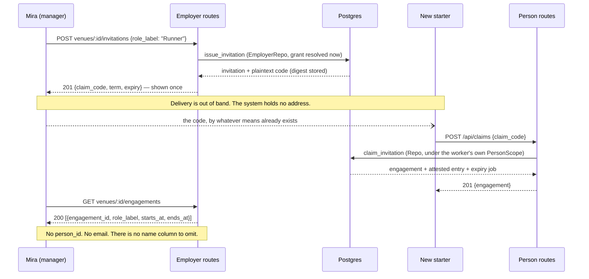
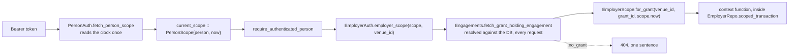
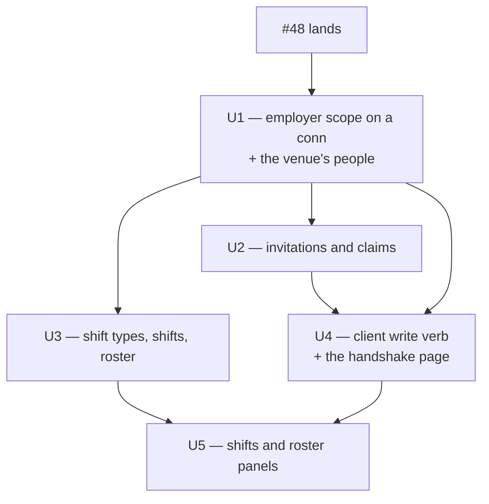

# feat: A crude employer view

## Summary

Five backend units' worth of HTTP transport and one unstyled page, so that a venue manager can
bring somebody onto the venue, create a shift, and roster them — in a browser, in two windows,
with the two-party handshake visible rather than hidden.

**Zero new tables and zero migrations** — `boundary_test.exs` is untouched and no grant is added
to any database on the cluster. That property is real and worth protecting.

**"Zero new domain capability" is not true, and an earlier draft of this plan claimed it.** Seven
of the nine routes are pure transport over finished, correctly-refusing context functions. Three
things are not:

- `Rooms.list_shift_rooms/1` gains an arity, a bound, and an ordering decision (KTD-E6);
- `Rosters.list_roster/2` returns rows carrying no `role_label`, so R13 has no source today
  (KTD-E10);
- **nothing lists the venues a person holds a grant at**, so the venue picker has no function
  behind it at all (OQ1).

The claim is corrected here rather than deleted because it was load-bearing: it is what made U1
through U3 sound like transport-only PRs, and it is what OQ1 was spending when it said the
alternative "costs the plan's zero-new-capability property". That property was already spent.

**Implementation waits for issue #48 to land.** It is establishing the controller shape, the
id-cast helper, the field-list render convention and the client's feature layering — four things
every unit below inherits. Building against them before they merge means guessing at all four.

---

## Problem Frame

The project's thesis is that the employer holds a lease rather than an account, and twelve units
built the mechanism. The worker's half of it is a real surface: `client/src/features/rooms/`,
`features/peers/`, `features/profile/`. The employer's half is asserted in tests and in a channel
that carries no events — `HospitalityComsWeb.EmployerVenueChannel` handles `join/3` and answers
everything else `bad_request`, and `lib/hospitality_coms_web/router.ex` declares no employer route.

So the sentence *"an employer can bring somebody onto the venue without ever creating their
account"* is, to anybody who cannot read Elixir, a claim about code they cannot see.

The gap is transport, not capability. That shapes every decision below: the plan's job is to add
the thinnest correct surface over finished contexts, and to make sure the two whole-struct
disclosures `CLAUDE.md` already records do not reach a client through it.

---

## Key Technical Decisions

### KTD-E1. The conn-side employer scope reads no clock

`HospitalityComsWeb.PersonAuth.fetch_person_scope/2` already read `Clock.now/0` once for this
request and put the result on `conn.assigns.current_scope`. The new resolver takes its instant
from there.

**Consequence, and it is checkable:** the new module must **not** appear in
`:boundary_modules` in `.credo.exs`. A diff that adds an entry there is a diff that read the clock
a second time in one unit of work, which is KTD5 broken.

**Do not restate that list from memory.** It holds **seven** entries — `PersonAuth`, `ChannelAuth`,
`HospitalityComs.Demo`, and four workers (`AccountReaper`, `EngagementSweeper`, `ExpireEngagement`,
`RetentionSweeper`). `CLAUDE.md` says four and names three; an earlier draft of this plan said
"four workers and two transports" and forgot `Demo`. Read the file. The rule here is only *"this
plan adds nothing to it"*, which is checkable without knowing the count.

### KTD-E2. One spelling of "resolve the acting grant", and `ChannelAuth` delegates to it

`ChannelAuth.employer_scope/2` derives a `PersonScope` from a socket, then resolves an authority
from it in two calls plus a six-line private helper. The conn side has the `PersonScope`
already — `require_authenticated_person` produced it — so its `:no_session` arm does not exist.

The shared part is therefore not transport-shaped at all: it is
`(PersonScope, venue_id) -> {:ok, EmployerScope} | {:error, :no_grant}`. New module
`HospitalityComsWeb.EmployerAuth` owns it; `ChannelAuth.employer_scope/2` keeps its signature and
delegates.

The alternative — duplicate the six lines on the conn side — is rejected by this tree's own
precedent. `HospitalityComsWeb.EntityId` was extracted for exactly this situation when a second
caller appeared, leaving `ChannelAuth.topic_id/1` delegating, and its moduledoc says why: *"there
is still exactly one spelling."*

**Naming caveat to write into the moduledoc:** `PersonAuth` authenticates and `EmployerAuth`
authorises, and two conn-side modules called `*Auth` that do different things is a trap for the
next reader. State it in the first paragraph rather than relying on the reader to notice.

### KTD-E3. Refusals are 404, and R17 forces it

`Engagements.fetch_grant_holding_engagement/2` answers `:no_grant` identically for an ended
engagement, an engagement holding nothing, a revoked grant, and a venue that does not exist. R17
requires the wire to preserve that.

So a status that varied by cause would break the requirement, and 404 with one sentence is the
only option that keeps it: *"no such venue, or it is not one you can act for."*

`EmployerVenueChannel` answers the same condition with `:unauthorized`. **That is a divergence and
it is deliberate** — a channel join has no resource semantics to be not-found about, and the
channel is internally consistent because it answers `:unauthorized` for a nonexistent venue too.
Record it in `EmployerAuth`'s moduledoc so a later reviewer does not read it as drift.

### KTD-E4. Two whole-struct disclosures, and where the pin goes

`CLAUDE.md` records both. `Engagements.list_invitations/1` returns structs carrying
`claim_code_digest` — *"render a field list, not the struct."* `Engagements.list_engagements/1`
returns structs carrying `person_id`, the globally stable cross-venue key.

U9's precedent is that the employer-visible views expose no `person_id` and their column lists are
pinned in `test/hospitality_coms/boundary_test.exs`. **A controller's JSON is pinned by nothing**,
so this plan puts the pin in three places, each catching what the others cannot:

1. **A structural `@spec` on every `render_*/1`** naming every key and its type. This is #48's
   convention already; Dialyzer fails when the function and the spec disagree.
2. **An exact key-set equality in the controller test**, against a literal list written out in the
   test file. Not a `refute Map.has_key?` — an absence assertion passes by default.
3. **A control beside it that asserts the *source struct* carries the withheld field**, via
   `__schema__(:fields)`. Without this, "the digest is not in the render" and "there is no digest"
   are the same green, which is
   `docs/solutions/test-failures/tests-that-certify-nothing.md`'s *"Cleared and never set as the
   same DOM"* shape.

The client carries the fourth: its decoders return objects whose key set is also pinned, so a
field the server adds does not silently reach a screen.

### KTD-E5. The form's three instants are defaulted on the server

`issue_invitation/2` requires `role_label`, `starts_at`, `ends_at` and `code_expires_at`, with no
defaults. A crude form cannot ask for three date-times, and a client that computes them is a
second clock — `HospitalityComs.Clock.Offset` moves the server's instant and would not move the
browser's, so U11's demo controls would desynchronise the two.

So all three are optional in the request body and the controller fills them from `scope.now`:

| Field | Default | Why this value |
|---|---|---|
| `starts_at` | `scope.now` | `list_engagements/1` returns only engagements **active at the scope's instant**. A term opening tomorrow produces, on claim, an engagement the manager's own people list does not show — which in a demo reads as the claim having failed. |
| `ends_at` | `scope.now + 90 days` | Long enough that nothing in a demo expires under it; short enough to be visibly a fixed term. |
| `code_expires_at` | `scope.now + 7 days` | The check constraint bounds validity at `issued_at + 14 days` **inclusive**. A default sitting exactly on a bound breaks the first time somebody rounds. |

The durations are named constants in the controller, and the tests assert against durations
written out in the test file rather than read from the constants they pin.

**The seven and the fourteen are independent constants, and issue #42 is why that is stated.**
That issue is a live sweep of *"six constant pairs held together by prose, and one that has
already drifted"* — a prose sentence linking a default to a bound is precisely the shape it
catalogues. So `code_expires_at`'s default is not derived from
`Invitation.max_code_validity_in_days/0`, and the only relationship asserted between them is a
**test**: the default lands strictly inside the bound. A checkable relationship, not a sentence.

**And note what the controller test can actually reach.** At `+14 days` exactly, the changeset
allows it; at `+14 days + 1 second` the changeset refuses it before Postgres is asked. So U2's
both-directions test pins the **changeset's** bound. The `invitations_code_expiry_within_bound`
check constraint is a separate declaration of the same number and is item 3 of issue #42; do not
claim this plan's tests cover it.

### KTD-E6. The employer shift-room list gets #48's `extent`

`Rooms.list_shift_rooms/1` is the one list in this surface that grows without limit — it returns
every shift room the venue has ever had. `AGENTS.md`: *"Paginate every list that grows with tenant
data."* #48 built the shape for this case: the bound belongs in the context, because a route that
passes a number leaves the unbounded function one forgetful caller away from production. That much
transfers unchanged.

**The ordering does not transfer, and getting it wrong hides tonight's shift.**
`read_shift_rooms/1` is `Records.rooms() |> of_venue() |> earliest_first()`. Putting a `limit` in
front of *that* returns the venue's **oldest** N shift rooms — so the moment a venue has more than
the bound, the default read stops containing the shift the manager just created, which is F2's
payoff. `list_venue_room_messages/3` does not have this problem because it splits into
`Records.most_recent(limit + 1)` and re-orders ascending inside `MessagePage.bounded/2`. The
shift-room query has no such split and one has to be written.

So the unit owes three decisions, not one:

1. **Which end.** `:recent` must mean the *latest* shift rooms — selection descending, then
   re-ordered for display, the shape `most_recent/2` already has.
2. **A `complete` flag.** U5's "load all" control cannot be built without it, and
   `MessagePage`'s own moduledoc says why a caller cannot recompute it: *"a full page and a full
   history of the same length are the same list."* Select `limit + 1` and notice, exactly as
   messages do. R18's key-set pin locks this shape in, so it must be decided before U3 renders
   anything.
3. **The bound itself**, one named function. **No relationship is asserted between it and the
   message bound** — issue #42 is open about constant pairs held together by prose, and two lists
   that happen to share a number are exactly that.

**Revised estimate: this is not forty-five minutes.** It is a new records function, a page struct
or an equivalent, an arity change, and the render shape. It is the largest single item in U3 and
is the reason U3 should split (see U3's Approach).

No production callers today — `grep -rn 'list_shift_rooms' lib/` finds only the definition.

### KTD-E7. Shift-type names are joined in the client

`list_readable_shift_rooms/1` preloads `:shift_type`; the employer's `list_shift_rooms/1`
deliberately does not. The employer page has already fetched the shift-type list in order to
create a shift, so it holds the id-to-name map. Joining there costs nothing and changes no context
behaviour; adding a preload is a behaviour change bought for a label the client can already
produce.

The edge case the client must handle: a shift room whose type id is not in the fetched list — the
type was created after the page loaded. Render the id, not `undefined`.

**The cost this buys, stated rather than skipped.** `RoomController.render_shift_room/1` already
renders a shift room, for the person side, as
`{shift_room_id, venue_id, shift_type_name, starts_at, ends_at, closes_at}` off a preloaded
`:shift_type`. Declining the preload means the employer's shift room is a *second shape* for one
entity, carrying `shift_type_id` where the person's carries `shift_type_name` — which is the
failure mode of `docs/solutions/conventions/one-entity-one-key-name-and-decoders-that-refuse-the-other.md`,
a document this plan cites. #48 obeyed that convention for messages: `render_message/1` calls
`RoomChannel.rendered/1` rather than respelling it.

So this decision is **not** free, and the honest comparison is:

- *preload on `list_shift_rooms/1`* — one render function for both sides, one behaviour change
  more, and it collides with KTD-E6 which is already rewriting that query;
- *client join* — no context change, two shapes for one entity, and a decoder that must refuse
  the other spelling so the divergence cannot spread silently.

Recommended: **preload**, now that KTD-E6 is rewriting the query anyway. Both changes then land in
one place and one render function serves both sides. The client join stays the fallback if U3
splits and the shift half ships first.

### KTD-E8. The client's request core gains one verb and nothing else

`client/src/api/client.ts` exposes four named calls and one generic `read`. This surface is mostly
writes, and there is no authenticated POST. The layering rule #48 wrote down is *"a feature owns
its paths and its wire shapes; this file owns 'an authenticated GET that decodes or fails'"* — so
`write` sits beside `read` under the same rule, one verb further. Nothing else moves into
`client.ts`.

`client/src/test-support/fake-api.ts` gains a matching stub, and it **must fail by default** the
way `read` does, so a surface cannot be tested without a reachable failure path.

**"One verb" is the intent; the surface needs two things `read` does not provide.** `read` is built
on an `expectBody(path, init, 200, decode)` primitive. This plan needs a POST whose success is
**201 with a body**, and a DELETE whose success is plausibly **204 with no body** — which is a
different primitive, `expectStatus`. So `write` either takes an HTTP method and a success status,
or there are two functions. **Decide it in U4**, because U5 ships the DELETE and its file list must
then include `client/src/api/client.ts`.

**Re-check the premise at execution time rather than trusting it.** `client/src/api/client.ts` is
the file #48 is actively editing — `read` is its addition. The claim "there is no authenticated
write" was true when this plan was written and is exactly the kind of claim that goes stale between
planning and the merge it waits on.

### KTD-E9. Every employer controller test is non-sandboxed

Mandatory, not stylistic. An employer surface reads through `HospitalityComs.EmployerRepo` by
definition, and the claim spans both repos' connections. Under the sandbox those are two
transactions that cannot see each other's rows, so every list would come back empty and **every
negative assertion in the file would pass for the wrong reason**.

The shape is `test/hospitality_coms_web/controllers/room_controller_test.exs`'s exactly:
`use ExUnit.Case, async: false`, `EngagementsFixtures.real_connections/0`, `Clock.Offset.set/1`
pinned in `setup` with `on_exit(&Clock.Offset.reset/0)`, and a local `with_session/2` that mints a
token and sets the `Authorization` header. `HospitalityComsWeb.ConnCase` is the sandboxed
alternative and must not be used here.

### KTD-E10. R13's role label has no source today, and the obvious client-side fix has a hole

`Rosters.list_roster/2` answers `{:ok, [RosterEntry.t()]}`, and `RosterEntry` carries `joined_at`,
`left_at`, `delete_after`, `venue_id`, `shift_room_id` and `engagement_id` — **no `role_label`**.
`Records.entries/1` selects the entry with no preload and no projection. So R13, *"each entry
naming the engagement and the role label"*, is unsatisfiable as the code stands.

Two fixes, and the cheap one is wrong:

- **Join on the client**, against the people list the page already holds. It has a hole that would
  not surface until a demo: `add_to_roster/3` accepts an engagement whose term *"must not have
  closed … it need not have opened"*, while `list_engagements/1` returns only engagements active
  at the instant. So a legitimately rostered future starter has **no label available on the
  client** and renders as a bare id.
- **Preload the engagement on `list_roster/2`** and project `role_label`. A second context
  behaviour change, and the only one that answers R13 for every row the function can return.

Recommended: **preload**. Then say so in the Summary's list — this plan makes two context changes,
not one, and pretending otherwise is what made the earlier "zero new domain capability" line wrong.

---

## High-Level Technical Design

### The handshake, which is the thing the surface exists to show

### Where the scope comes from, per request

Nothing between `C` and `H` is cached. `EmployerVenueChannel`'s moduledoc states the rule for the
socket and it applies verbatim here: build the scope from a fresh derivation on every request,
never read a stored `grant_id`.

### Unit dependencies

---

## Requirements Traceability

| Origin | Where it lands |
|---|---|
| R1, R2, R3, R4 | U2 |
| R5, R6, R20 | U2 (transport), U4 (the claim box) |
| R7 | U1 |
| R8, R9, R10, R11 | U3 |
| R12, R13, R14, R15 | U3 |
| R16, R17 | U1 (the mechanism), asserted again per route in U2 and U3 |
| R18 | U1, U2, U3 (server pins), U4, U5 (decoder pins) |
| R19 | U4, U5 |

---

## Implementation Units

Five units. Each is one PR through the established workflow: test-design brief committed alone as
the first commit on the branch, then implementation, then `mix quality` / `npm run verify`, then
review, then CI and Greptile.

**Every unit's brief must name its approver, and say in the file when the orchestrator approved in
the human's place; the PR body repeats that substitution.** `AGENTS.md` requires both, and
`docs/test-designs/2026-07-29-48-room-lists-and-history.md` is the nearest example of the shape.

**What every unit inherits from #48**, so it is not re-derived five times:

- the `:api` and `:authenticated_person` pipelines, and the fact that `fetch_person_scope`
  puts this request's instant on `current_scope`;
- `HospitalityComsWeb.EntityId.cast/1` for every id off the wire, byte-size guard included;
- the private `refuse/3` whose status atom **is** the envelope's code, so the two cannot drift;
- `render_*/1` field lists with a structural `@spec` naming every key; plural resource-named
  envelope keys; instants as `DateTime.to_iso8601/1` strings;
- the non-sandboxed controller-test shape (KTD-E9);
- on the client: a `features/<name>/` directory owning its own paths, wire shapes, decoders,
  refusal sentences and hooks, with one `<Route>` line added to `client/src/app/app.tsx`.

---

### U1. The employer scope on a conn, and the venue's people

- **Goal:** A logged-in manager can read their venue's active engagements over HTTP, and every
  later employer route has a resolver to copy.
- **Requirements:** R7, R16, R17, R18. Covers AE5, AE6, AE10.
- **Dependencies:** #48 merged.
- **Carries the venue picker's read if OQ1 resolves that way.** `GET /api/employer/venues` plus one
  new context function — venues where this person holds an engagement carrying a live grant,
  suspensions not consulted. It belongs here rather than in U4 because it is the same resolver's
  question asked without a venue id, and AE10 ("no venues, one sentence") is its test.
- **Files:**
  - `lib/hospitality_coms_web/employer_auth.ex` (new)
  - `lib/hospitality_coms_web/channel_auth.ex` (delegate `employer_scope/2`)
  - `lib/hospitality_coms_web/controllers/employer_controller.ex` (new)
  - `lib/hospitality_coms_web/router.ex`
  - `test/hospitality_coms_web/controllers/employer_controller_test.exs` (new)
  - `test/hospitality_coms_web/channels/employer_venue_channel_test.exs` (unchanged assertions,
    re-run as the delegation's regression proof)
- **Approach:** `EmployerAuth.employer_scope(%PersonScope{}, venue_id)` per KTD-E2, taking its
  instant off the scope per KTD-E1. One new route,
  `GET /api/employer/venues/:venue_id/engagements`, on the existing `:authenticated_person`
  pipeline — the venue is a path parameter, so there is no employer pipeline to add and nothing to
  gain from one. Render a field list per KTD-E4: `engagement_id`, `role_label`, `starts_at`,
  `ends_at`, and nothing else.
- **Execution note:** Write the key-set pin and its `__schema__(:fields)` control first. They are
  the assertions the whole unit exists to make true, and they are the two most likely to be
  written vacuously.
- **Patterns to follow:** `lib/hospitality_coms_web/controllers/room_controller.ex` for the action
  shape; `lib/hospitality_coms_web/entity_id.ex` for the extraction precedent.
- **Test scenarios:**
  - A manager reads their venue and gets the venue's engagements that are active at the pinned
    instant, oldest first.
  - **Covers AE6.** The rendered engagement's key set equals a literal list written out in the
    test. **Control:** the same test asserts `Engagement.__schema__(:fields)` contains
    `:person_id`, so an empty render cannot pass for a redacted one.
  - **Covers AE5.** A person holding an engagement but no grant at that venue is refused.
    **Control:** the *same person*, at the venue where they do hold a grant, gets 200 — so the
    refusal is about the grant and not about the session. (Seed shape: Ana at Harbour and Ana at
    Kolektiv.)
  - A venue id naming nothing produces a response body **byte-identical** to the previous case's.
    Asserting equality rather than matching each separately is what proves flatness.
  - A **16-byte** id produces that same body. This is the case that kills the mutation: delete
    `byte_size(id) == 36` from `EntityId.cast/1` and `Ecto.UUID.cast/1` encodes sixteen raw bytes
    into a valid-looking id naming nothing. A 35-character id may be tested too, but it proves
    nothing about the guard — `cast/1` rejects it unaided — so it must not be described as
    evidence for it.
  - No `Authorization` header → 401 from `require_authenticated_person`, not 404.
  - **R16, and it must be aimed at the transport rather than the context.** Revoking the grant
    between two requests and asserting the second is refused **cannot fail for the mechanism this
    unit builds**: `Engagements.read_engagements/1` opens with `Venues.fetch_acting_grant(scope)`,
    which resolves the grant live-at-instant inside *every* employer context call. Hand
    `EmployerAuth` a stale grant id and `list_engagements/1` still refuses. So the assertion goes
    against `EmployerAuth.employer_scope/2` **directly** — revoke, call it, get `:no_grant` — and
    the route-level test is labelled as end-to-end coverage rather than as proof of re-derivation.
  - The list is asserted **non-empty before anything is asserted about it**. KTD-E9 names an
    environment failure whose whole signature is that every list comes back empty; without this
    line, every key-set pin below is the "both operands empty" shape.
  - An engagement whose term opens after the pinned instant is absent; advancing `Clock.Offset`
    past its `starts_at` makes the same engagement present. *Fails without* `list_engagements/1`'s
    active-at-instant filter, and pins the assumption KTD-E5's `starts_at` default rests on.
  - `EmployerVenueChannel`'s existing join tests still pass unchanged after `employer_scope/2`
    becomes a delegation.
- **Verification:** A seeded manager reads their venue's people over HTTP; a seeded non-manager at
  the same venue cannot; `mix quality` clean; `.credo.exs` unchanged.

---

### U2. The handshake: invitations out, claims in

- **Goal:** A manager issues an offer and receives a code; a person claims it in their own session.
- **Requirements:** R1–R6, R16, R18, R20. Covers AE1, AE2, AE3, AE4.
- **Dependencies:** U1.
- **Files:**
  - `lib/hospitality_coms_web/controllers/employer_controller.ex`
  - `lib/hospitality_coms_web/controllers/claim_controller.ex` (new)
  - `lib/hospitality_coms_web/router.ex`
  - `config/config.exs` (`filter_parameters`, see Approach)
  - `test/hospitality_coms_web/controllers/employer_controller_test.exs`
  - `test/hospitality_coms_web/controllers/claim_controller_test.exs` (new)
- **Approach:** `POST /api/employer/venues/:venue_id/invitations` with `role_label` required and
  the three instants optional per KTD-E5. `POST /api/claims` on the person pipeline, taking
  `claim_code` and nothing else — `claim_invitation/2` casts nothing from the caller because
  accepting an offer is accepting *the* offer.

  **The claim's failure shape is `Ecto.Multi`'s 4-tuple, not `{:error, reason}`.** The controller
  matches `{:error, :consume, :unknown_code | :already_claimed | :code_expired, _}` and
  `{:error, :conferrable, :grant_not_live, _}`, plus the three changeset arms. Do not write a
  two-element `{:error, reason}` clause and expect it to match.

  R6 says the three code failures are distinguishable, and that is not a disclosure: an unknown
  code, an expired code and a claimed code tell the holder of a code nothing they do not have.
  This is the one place the surface is *not* flat, and the reason is written into the moduledoc so
  it is not "fixed" later.

  **`claim_code` must be added to `filter_parameters`, and today nothing would redact it.**
  Verified: there is no `config :phoenix, :filter_parameters` line anywhere in `config/`, so
  Phoenix's default of `["password"]` applies and matches nothing here. `config/prod.exs` sets
  `level: :info`, which keeps params out of production logs — but `config/dev.exs` sets no level,
  so the default `:debug` applies and `Phoenix.Logger` prints the request params. **The demo runs
  in dev.** So a live, unexpired claim code would be printed to the terminal the presenter is
  standing next to, and `AGENTS.md`'s auto-redacted fragment list — `token`, `secret`, `key`,
  `credential`, `authorization`, `otp`, `pin`, … — contains nothing that matches `claim_code`. Two
  lines of config, and a test asserting the filter covers the key.
- **Execution note:** Write the code-expiry bound at both `14 days` and `14 days + 1 second`
  before writing the controller. A bound tested from one side is the shape
  `tests-that-certify-nothing.md` calls a guard exercised from one side only.
- **Patterns to follow:** `ErrorEnvelope.for_changeset/3` for field errors; U1's render discipline.
- **Test scenarios:**
  - **Covers AE1.** Issuing with only `role_label` returns 201 carrying a plaintext `claim_code`.
    The response key set equals a literal. **Control:** `Invitation.__schema__(:fields)` contains
    `:claim_code_digest`.
  - The three defaults land on `scope.now`, `+90 days` and `+7 days`, asserted against durations
    **written out in the test file** rather than read from the controller's constants.
  - Explicit `starts_at`, `ends_at` and `code_expires_at` in the body override the defaults.
  - `code_expires_at` at exactly `issued_at + 14 days` is accepted; one second later is a field
    error. Both directions.
  - `ends_at` at or before `starts_at` is a field error naming `ends_at`.
  - **Covers AE2, and it needs two claimants.** Two invitations for the same role return two
    different codes, and both claim successfully. **Claimed by one person they cannot both
    succeed** — under KTD-E5 both carry `starts_at = now` and `ends_at = now + 90 days`, so the
    second collides with `engagements_no_overlap` and returns `{:error, :engagement, changeset, _}`.
    The cheap fixture is one person and the failure reads as a controller bug.
  - **F1 end to end.** A claim with a good code returns the engagement, and the issuing manager's
    people list then contains it. This is the test that would fail if `starts_at` defaulted to
    tomorrow.
  - **Covers AE3, and the fixture is two claimants and one code.** The second is refused and
    **exactly one** engagement exists from that invitation. The obvious fixture — one person
    claiming twice — is a test that certifies nothing: two claims by one person build two
    engagements with identical `person_id`, `venue_id` and term, which collide on
    `engagements_no_overlap`, so **deleting the conditional `UPDATE` entirely leaves the count at
    one**. Two claimants produce non-overlapping engagements, so the count is 2 without the
    consume step and the guard is the only thing holding it at 1. This is also the race
    `claim_invitation/2`'s own doc names.
  - **Covers AE4.** A code past `code_expires_at` is refused naming expiry; the same code one
    second before is accepted. Both directions.
  - An unknown code is refused and **no engagement row is written** — asserted by counting before
    and after.
  - A claim with no session is 401.
  - A claim carrying no `claim_code` key is `bad_request`, distinct from an unknown code.
  - **The claim response's key set is pinned too.** R18 says "employer-facing", and this response
    goes to the *person* — but it is the one response in the plan whose source is a whole schema
    (`Engagement` carries `person_id`, `invitation_id`, `grant_id`, `lock_version`, `accepted_at`)
    and the only one with no literal behind it. It is the person's own id, so nothing here is a
    boundary breach; it is an unpinned shape U12's client will be written against.
  - `Phoenix.Logger`'s filter redacts `claim_code`. **Control:** the same assertion over a key
    that is *not* filtered, so a filter list that redacted everything — or a test asserting
    against a helper that always says redacted — is distinguishable from one that redacts this
    key.
  - **Reachability note to record in the brief:** the `:conferrable, :grant_not_live` arm is not
    reachable from this transport, because the crude form does not offer `grant_id`. Cover the
    controller's clause by calling the private mapper directly, or state in the brief that the arm
    is covered at the context level in `test/hospitality_coms/engagements_test.exs` and carried
    here untested. Do not write a test that appears to reach it and does not.
- **Verification:** Two sessions, two windows, one code: the manager's people list gains a row it
  did not have, and nothing in either response body carries `claim_code_digest`.

---

### U3. Shift types, shifts, and the roster

- **Goal:** A manager lists shift types, creates and lists shifts, and adds, lists and removes
  roster entries.
- **Requirements:** R8–R15, R18. Covers AE7, AE8, AE9.
- **Dependencies:** U1. **Not U2** — the roster tests use a fixture engagement from
  `EngagementsFixtures`, not a claimed one. The Verification line below describes the demo path and
  is not what the suite does; if an implementer reaches for U2's claimant, this unit has acquired
  a dependency and the graph is wrong.
- **This unit should split, and here is the line.** Six routes, a context rewrite with an arity
  change and an ordering decision (KTD-E6), a second context change for roster labels (KTD-E10),
  `rooms/records.ex`, `rooms_test.exs`, and roughly a dozen controller scenarios — against U1's one
  route. Cut it at **shift types + shift rooms + extent** | **roster**. The roster half needs
  nothing from the shift half except a `shift_room_id`, which a fixture supplies.
- **Files:**
  - `lib/hospitality_coms/rooms.ex` (`list_shift_rooms/2` with an extent; a named bound)
  - `lib/hospitality_coms/rooms/records.ex`
  - `lib/hospitality_coms_web/controllers/employer_controller.ex`
  - `lib/hospitality_coms_web/router.ex`
  - `test/hospitality_coms/rooms_test.exs`
  - `test/hospitality_coms_web/controllers/employer_controller_test.exs`
- **Approach:** Six routes, all under `/api/employer/venues/:venue_id/`: `GET shift-types`,
  `POST shift-rooms`, `GET shift-rooms`, `POST shift-rooms/:shift_room_id/roster`,
  `GET shift-rooms/:shift_room_id/roster`,
  `DELETE shift-rooms/:shift_room_id/roster/:engagement_id`.

  `create_shift_room/3` takes the shift type as a positional argument and takes `venue_id` and
  `grace_period_minutes` from the resolved type — neither is castable, and the tests prove it
  rather than trusting it.

  **Three context changes, not one**, each needing a ⚠️ **POTENTIAL REGRESSION** disclosure in the
  brief in `AGENTS.md`'s format: `list_shift_rooms/1`'s extent and ordering (KTD-E6), the
  `:shift_type` preload that lets one render function serve both sides (KTD-E7), and
  `list_roster/2`'s engagement preload for `role_label` (KTD-E10). The first two land in the same
  query and should be written together. `grep -rn 'list_shift_rooms\|list_roster' lib/` is the
  no-production-callers evidence line for the brief.
- **Execution note:** Build the shift-room fixture at **bound + 1** rooms before writing the
  bound. #48's own issue names this: *"A test that asserts '50 came back' against a fixture
  holding 12 passes for the wrong reason."*
- **Patterns to follow:** `Rooms.list_venue_room_messages/3` and `Rooms.MessagePage` for the
  extent shape; `RoomController.venue_room_messages/2` for the `extent` query parameter and its
  `bad_request`.
- **Test scenarios:**
  - Shift types come back ordered, key set pinned to a literal.
  - Creating a shift room with a valid type returns 201; the room's `venue_id` and
    `grace_period_minutes` match the **type's**, not the request's. **Control:** the request body
    carries a different `venue_id` and `grace_period_minutes` and both are ignored — without this
    the "not castable" claim is untested.
  - `ends_at` at or before `starts_at` is a field error.
  - **Covers AE7.** A shift type belonging to another venue produces a body byte-identical to a
    shift-type id naming nothing.
  - **KTD-E6, and the assertion is about *which* rooms, not how many.** With `bound + 1` shift
    rooms at the venue, the default extent returns exactly the bound **and the newest one is in
    it**; `extent=all` returns all of them. Two counts would not catch the defect that matters:
    `read_shift_rooms/1` is `earliest_first`, so a limit applied to it returns the **oldest**
    rooms and satisfies every count assertion while hiding tonight's shift. `MessagePage`'s
    moduledoc names this as *"the one mistake this function can make silently"*, and
    `room_controller_test.exs` answers it by naming the first and last rows rather than counting.
    Do the same here.
  - `complete` is `false` at the default extent over `bound + 1` rooms and `true` over `bound - 1`.
    Both directions, because a flag hard-coded either way passes one of them.
  - `extent=nonsense` is `bad_request`, distinct from 404.
  - Rostering an engagement returns 201 and the roster lists one entry.
  - **R13.** Each roster entry carries `role_label` (KTD-E10). **The row that proves the preload
    rather than a client join** is an engagement whose term has **not opened** at the scope's
    instant — legal to roster, absent from `list_engagements/1`, and therefore unlabellable from
    the client. Without this row the client join looks sufficient.
  - **Covers AE8.** Rostering the same engagement twice: the second is refused and the roster
    **still lists one entry**. A count, not a message.
  - **Covers AE7.** Rostering onto another venue's shift room, and rostering another venue's
    engagement, both produce the same body as an id naming nothing — three responses compared for
    equality.
  - **Covers AE9.** Removing an entry empties the roster, **and the `roster_entries` row still
    exists with `left_at` set**. The second half is KTD6b and is the control that distinguishes
    "closed" from "deleted".
  - Removing an engagement that is not rostered is refused; removing from a shift room that does
    not exist gets the same answer, because `remove_from_roster/3` answers `:not_rostered` for
    both.
  - Every response's key set is pinned to a literal.
- **Verification:** A manager creates tonight's shift at Harbour, rosters the U2 claimant onto it,
  and the claimant's own shift-room list (the #48 route) now contains it.

---

### U4. The client's write verb, and the handshake on screen

- **Goal:** Flow F1 works in a browser: pick a venue, see the people, issue an offer, copy the
  code; and in a second window, claim it.
- **Requirements:** R2, R5, R6, R7, R19. Covers AE10.
- **Dependencies:** U1, U2.
- **Files:**
  - `client/src/api/client.ts`, `client/src/api/client.test.ts`
  - `client/src/test-support/fake-api.ts`
  - `client/src/features/employer/employer-route.tsx`, `employer-api.ts`, `decode.ts`,
    `refusal-message.ts`, `use-employer-venue.ts` (all new)
  - `client/src/features/employer/employer.test.tsx` (new)
  - `client/src/features/claim/claim-panel.tsx`, `claim-api.ts`, `claim.test.tsx` (new)
  - `client/src/app/app.tsx`
- **Approach:** `ApiClient.write` beside `read` per KTD-E8, tested against a stub `fetch` the way
  `read` is — that is the whole test seam and it does not move. `fake-api.ts` gains `writesTo` and
  a default-failing `write`.

  Venue discovery reuses `GET /api/venue-rooms` from #48, which already returns `{venue_id, name}`
  for every venue the person is engaged at. See **Open Questions, OQ1** — this is the
  recommendation, not a settled fact, and it is the one decision in the plan that changes what the
  demo shows.

  The claim panel is person-side and lives in its own feature directory, not inside `employer/`.
  It is the worker's half of the handshake.
- **Execution note:** Check the test filename against
  `docs/solutions/test-failures/a-test-file-the-typechecker-cannot-see.md` before creating it. A
  `*.test.tsx` whose basename matches an existing `*.test.ts` is invisible to `tsc` and to eslint
  while vitest runs it green — a 62-test suite escaped both for a whole unit that way.
- **Patterns to follow:** `client/src/features/rooms/rooms-api.ts` and `use-room-lists.ts` for the
  fetching shape; `client/src/features/rooms/decode.ts` for all-or-nothing list decoding.
- **Test scenarios:**
  - `write` sends the **method** it was given, attaches the bearer header, treats only the
    expected status as success, turns any other status into the decoded envelope failure, and
    turns an unexpected body shape into `malformed_response`. **Control:** a bodiless success
    (204) is a success and not `malformed_response` — the case U5's DELETE needs and the one a
    `read`-shaped implementation gets wrong.
  - `fake-api`'s `write` fails by default, asserted directly — otherwise a surface can be tested
    without ever meeting a failure.
  - The venue picker lists the venues from the venue-room read; choosing one loads that venue's
    people.
  - **Covers AE10.** A person with no venues sees one sentence, not an empty page and not an
    error.
  - Issuing shows the claim code and the warning that it will not be shown again; dismissing hides
    it; **re-rendering does not bring it back**. The last clause is the assertion — the first two
    pass trivially.
  - A refused issue renders the sentence from the envelope, not a generic one. **Control:** a
    second test with a different server sentence renders that one, so the component is not
    hard-coding a string that happens to match.
  - The decoder's output key set for an engagement equals a literal, and a payload carrying an
    extra `person_id` decodes without it — the client-side twin of KTD-E4's pin.
  - The claim panel: a good code renders the resulting engagement; a refused claim renders the
    envelope's sentence; an empty submission does not call the API.
  - **The negative test reaches the positive state first.** The "code is gone after dismiss" test
    must show the code first, or "hidden" and "never rendered" are the same DOM.
- **Verification:** Two browser windows, the seeded manager and a fresh address, and the code
  changes hands with no console. `npm run verify` clean.

---

### U5. Shifts and roster on screen

- **Goal:** Flows F2 and F3 work in a browser.
- **Requirements:** R8–R15, R19.
- **Dependencies:** U3, U4.
- **Files:**
  - `client/src/features/employer/employer-route.tsx`, `employer-api.ts`, `decode.ts`,
    `use-employer-shifts.ts` (new), `use-employer-roster.ts` (new)
  - `client/src/features/employer/shifts.test.tsx`, `roster.test.tsx` (new)
  - `client/src/api/client.ts` — **only if** U4 did not give `write` a method parameter; the
    roster DELETE is this unit's, and it must not be smuggled into a feature file
- **Approach:** Three panels below the people list: shift types, a create-shift form, and a roster
  panel opened from a shift. Shift-type names are joined client-side per KTD-E7. The shift list
  carries the "load all" control the extent needs.
- **Patterns to follow:** #48's own "load all" control, whichever shape it lands in — this unit
  copies it rather than inventing a second one.
- **Test scenarios:**
  - The shift list labels each room with its type's name.
  - A shift room whose `shift_type_id` is absent from the fetched type list renders the id rather
    than `undefined`. **Control:** a room whose type *is* present renders the name, so the
    fallback is not the only path exercised.
  - The create form submits and the new shift appears in the list.
  - "Load all" fetches the unbounded extent and renders more rows than the bounded read did.
    **Control:** the bounded read's row count is asserted first, against a fixture holding more
    than the bound — otherwise both reads return the same rows and the control passes for the
    wrong reason.
  - Adding an engagement to a roster from the people list, and the roster showing it.
  - Removing it, and the roster being empty afterwards — having shown it first.
  - A refusal from any of the five calls renders the envelope's sentence.
- **Verification:** F2 and F3 run in the browser against the seeded Harbour venue; the claimant's
  own client can read the shift room they were rostered onto.

---

## Scope Boundaries

### Deferred for later (carried from origin)

- **Creating shift types.** `Venues.create_shift_type/3` exists; the seed provides two at Harbour
  and none at Kolektiv, so a venue with no types cannot create a shift.
- **Listing outstanding invitations.** `list_invitations/1` exists and returns structs carrying
  `claim_code_digest`; rendering it needs U1's field-list discipline and adds no capability.
- **Ending and renewing engagements.** U11's demo controls already drive the revocation story.
- **Issuing and revoking grants** — making a second manager.
- **A read of the venues a person administers.** See OQ1.

### Outside this product's identity (carried from origin)

- Any form taking a worker's email, name or phone number.
- Delivering the claim code from inside the system.
- An employer view of who a worker is elsewhere.

### Deferred to follow-up work (plan-local)

- **The `person_id` disclosure in `list_engagements/1` itself.** This plan stops it reaching a
  client. It does not change the context function, which still returns whole structs to an
  employer session — closing that is the KTD2-level change `CLAUDE.md` already records.
- **`EmployerVenueChannel` events.** Nothing here adds one. The channel's per-event re-derivation
  rule stays inert for one more unit.

---

## System-Wide Impact

- **`.credo.exs` must not change.** KTD-E1. An added `boundary_modules` entry is the tell that the
  scope resolver read the clock.
- **`ChannelAuth.employer_scope/2` becomes a delegation.** Its signature and behaviour are
  unchanged, and `employer_venue_channel_test.exs` is the regression proof. `CLAUDE.md`'s Realtime
  section names the function and will need a sentence saying where the resolution now lives.
- **`Rooms.list_shift_rooms/1` changes shape** (KTD-E6). No production callers;
  `test/hospitality_coms/rooms_test.exs` destructures it and changes mechanically.
- **`CLAUDE.md` gains an Employer transport section**, and its two whole-struct disclosure notes
  gain a line each saying the HTTP surface renders field lists and where the pins are.
- **`boundary_test.exs` is not touched.** No migration, no new table, no new grant, no new view.
  This whole plan adds zero rows to the schema.
- **The router's justification for the narrow rate limiter goes stale, and U2 must address it.**
  `router.ex` says of the authenticated routes: *"The limiter above is deliberately not extended to
  them: they need a live session, **they write nothing**, and their cost is bounded in
  `HospitalityComs.Rooms` rather than at the door."* These are the API's first authenticated
  **write** routes. `POST /api/claims` writes four rows and an Oban job per request and, by R6,
  answers distinguishably for unknown / already-claimed / expired; `POST .../invitations` is
  unbounded per manager. Either extend the comment or state, as #48 did, that extending the
  limiter was considered and declined — `CLAUDE.md` already files fan-out and abuse control under
  issue #15, which is where a real answer belongs.

---

## Risks and Dependencies

- **#48 must land first.** Four conventions come from it. If it changes shape in review — the
  `extent` spelling most likely — U3 and U5 inherit the change.
- **Another agent holds the main checkout and the shared Postgres cluster.** Grants are
  database-local while roles are cluster-global (`docs/solutions/database-issues/`), so a
  migration run against a second database on the same cluster breaks `PostgresRolesTest` in the
  test database. This plan adds no migration, which removes the risk rather than managing it.
- **PR #51 (issue #45) gives every employer route a real statement timeout, for the first time.**
  `statement_timeout = '5s'` and `idle_in_transaction_session_timeout = '10s'` were set on
  `employer_role` in U1 and have never taken effect, because role settings apply at login and
  `SET ROLE` does not re-apply them. #17's dedicated login role made the fix possible and #51
  applies it. Every route in this plan runs inside `EmployerRepo.scoped_transaction/2` and is
  therefore capped from the moment it merges. Nothing here should come close — the PR measured
  154 ms as the longest employer statement in the suite, and that one is parked on a lock
  deliberately — but this surface is the first to put those queries behind an HTTP request, so it
  is the first that could find the cap.
- **The demo depends on the seed's distinct role labels.** They are the entire mitigation for
  having no name column. Verified distinct **per venue** — General Manager / Server / Bartender at
  Harbour, Owner / Kitchen Porter / Barista at Kolektiv. A seed change that duplicated a label
  within one venue would degrade the surface with nothing failing.
- **Kolektiv has no shift types**, so F2 and F3 are reachable only at Harbour. An audience that
  picks the wrong venue meets a dead end that looks like a bug.
- **Oban's staging query is bound to real wall-clock time.** Not exercised by this plan — nothing
  here enqueues except the claim, whose expiry job nobody waits for — but the U11 rule stands: do
  not demonstrate anything by advancing the clock and waiting for a queue.

---

## Open Questions

**OQ1 — how does the page know which venue it is acting for?** There is no context function
listing the venues a person holds a **grant** at. This is the plan's one real fork and the
recommendation changed once the venue-room list was read properly.

- *Reuse `GET /api/venue-rooms` from #48* — venue ids **and names**, zero backend work. It is a
  **superset in one direction and a strict subset in another**, and the subset is the problem.
  `list_venue_rooms/1` is documented *"Active engagements minus suspensions"* and applies
  `unsuspended(instant)`; `fetch_grant_holding_engagement/2` never consults suspensions. **So a
  manager who used the person-side venue-room opt-out keeps full employer authority and vanishes
  from the picker entirely**, with no other way into their own venue. That is the coupling KTD18
  exists to prevent, and `RoomController`'s own moduledoc warns against the same mistake one layer
  down: *"a gate would quietly extend suspension to shift rooms."* The other side effect — Ana
  seeing Harbour and being refused — is the cosmetic one.
- ***Recommended:* a new `GET /api/employer/venues`** backed by one new context function: venues
  where this person holds an engagement carrying a live grant, suspensions **not** consulted. It
  is a genuinely new domain capability — and per the corrected Summary, this plan already makes two
  context changes, so the property that argument was protecting is spent. Roughly the size of U1's
  route, and it belongs in U1 rather than U4.
- *Crudest:* paste a venue UUID. Correct, and it makes the demo's first move a UUID paste.

Reusing the venue-room list remains defensible **if suspension is declared out of demo scope**, in
which case the hole is recorded rather than closed. That is the user's call, not the plan's.

**OQ2 — does "remove from roster" ship?** Planned in U3 and U5. `remove_from_roster/3` exists, and
a demo that can roster but not un-roster invites the question at the worst possible moment. Drop
it and both units get slightly smaller.

**OQ3 — the defaults in KTD-E5.** Ninety days and seven days are judgement, not derivation. The
`starts_at` default is **not** judgement — it is forced by `list_engagements/1` being
active-at-instant.

**OQ4 — is KTD-E6's bound worth its cost?** Roughly forty-five minutes inside U3. The plan treats
it as in scope, and the origin makes it R11, so **dropping it means dropping a requirement rather
than trimming a unit.** Recommended in: `AGENTS.md` says paginate every list that grows with tenant
data, and *"crude does not exempt the backend from any of it."* Shipping a knowingly unbounded list
against a written standard should be a decision somebody makes, not one the plan makes quietly.

**Deferred to implementation:** the exact route path shapes (`/api/employer/venues/:venue_id/...`
versus a flatter spelling), the private function names inside the controller, and whether
`EmployerController` stays one module or splits once it carries eight actions.

---

## Sources and Research

- `docs/brainstorms/2026-07-29-crude-employer-view-requirements.md` — origin.
- Issue #48 and commits `b659819` (brief) and `f87d789` (implementation) — the controller shape,
  `EntityId`, the render convention, the client layering.
- Issue #42 — *"six constant pairs held together by prose"*; why KTD-E5's defaults are not derived
  from the bound they sit inside, and what U2's expiry test does and does not cover.
- Issue #45 and PR #51 — the employer statement timeout that has never taken effect and is about
  to.
- `AGENTS.md` — the type-spec rule, the test-design gate, the pagination rule, the regression gate.
- `CLAUDE.md` — the bridge, the zones, the two whole-struct disclosures, the clock authority.
- `docs/solutions/test-failures/tests-that-certify-nothing.md` — every "Control:" line above.
- `docs/solutions/test-failures/a-test-file-the-typechecker-cannot-see.md` — U4's execution note.
- `docs/solutions/conventions/one-entity-one-key-name-and-decoders-that-refuse-the-other.md` —
  why the rendered key names must be chosen once and refused by the decoder.
- No external research. The technology is settled, the patterns are local and three days old, and
  no option set in this plan lives outside the repository.
</content>

---

## Decisions taken on the open questions

Recorded 2026-07-29, by the product owner, after the adversarial review that
produced OQ1's flip.

**OQ1 — venue discovery: a new grant-based read.** Not `GET /api/venue-rooms`.
The review's finding stands and is the reason: `Rooms.list_venue_rooms/1`
subtracts suspensions and `Engagements.fetch_grant_holding_engagement/2` does
not, so a manager who used the venue-room opt-out keeps full authority over the
venue and disappears from their own picker, with no other way in. Reusing #48's
list would couple an employer capability to a person-zone opt-out, which is the
coupling KTD18 exists to prevent — and it would do it silently, since the
manager's authority still works everywhere else.

U1 therefore carries the new read, and its test must include a **suspended
manager** who still appears. Without that case the endpoint is
indistinguishable from the one it was chosen over.

**Remove-from-roster ships.** `Rosters.remove_from_roster/3` exists and is one
conditional statement. It goes in U3's roster half and U5's panel. A roster you
can only add to is a trap in a demo, where the first mistake is unrecoverable
without `iex`.

**Invitation defaults stand**: term starts now, ends +90 days, claim code
expires +7 days — inside the 14-day cap
`invitations_code_expiry_within_bound` enforces.

**The shift-room bound stands**, at its corrected cost. `Rooms.list_shift_rooms/1`
orders earliest-first, so a naive limit returns the venue's *oldest* rooms and
hides the shift the manager just created — F2's payoff. It needs the
`most_recent(limit + 1)` then re-order split that `list_venue_room_messages/3`
already uses, plus a `complete` flag. The bound was kept knowing this.

## One thing found while planning that is not this plan's work

`filter_parameters` is configured nowhere, so Phoenix's default `["password"]`
applies — and U2 deleted passwords from this application, so the default filter
matches a field that does not exist. Magic-link tokens already log in plaintext
in dev today; `POST /api/claims` would join them.

Filed as **issue #53**. U2 of this plan must not land before it, or the demo
prints a credential to a shared terminal.
