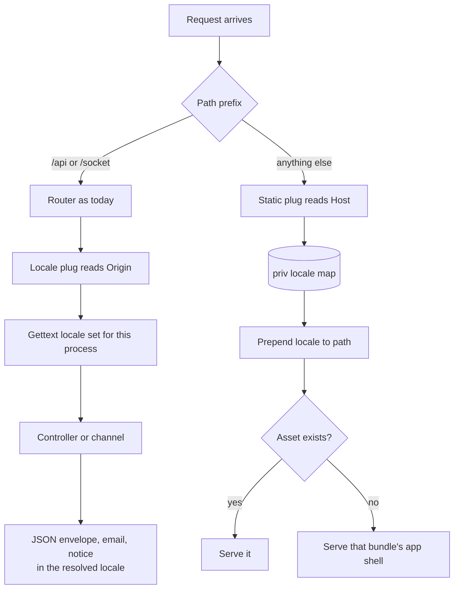
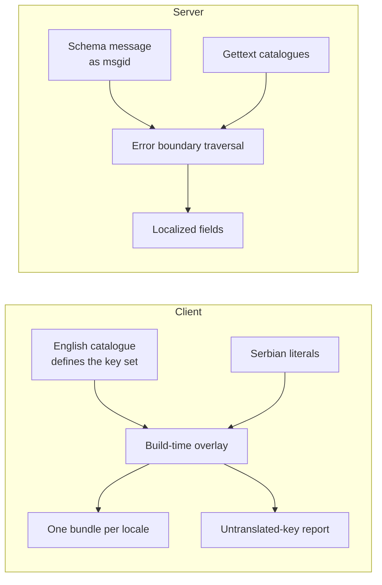

# feat: Localize the platform into English and Serbian

## Summary

Move every user-facing string out of components and schemas into per-locale literal files, build
one client bundle per locale, and have Phoenix serve the bundle matching the request host while
resolving the same locale for validation messages, emails and the incompleteness notice.

---

## Problem Frame

Someone who does not read English cannot use the product at all. The origin document establishes
why that is a floor rather than a polish item, and bounds the work: the API's error envelope
documents `message` as log-facing and the client does not render it, so the refusal copy a person
reads is already client-side and keyed on a machine code. The API contract does not change.

Three things make this larger than a string sweep. Nothing in the tree serves the client today —
`lib/hospitality_coms_web/endpoint.ex` states there is no static file serving — so the serving
decision is new code rather than configuration. The client uses `BrowserRouter` with client-side
paths including the magic-link target, so serving it from Phoenix drags in an app-shell fallback
that must not swallow the API's flat 404s. And Gettext, though a dependency since the project was
scaffolded, has never had a caller.

---

## Requirements

R-IDs are the origin document's, carried forward unchanged so the two artifacts can be read
together. R21 is new and was discovered during research.

### Locale resolution

R1. Two locales: `en` as the default and `sr-Latn`. English is the fallback for every surface.

R2. The locale a person receives is determined solely by the domain they access the platform on.

R3. A single checked-in artifact maps domain to locale, and every consumer reads it rather than
restating the rule.

R4. A domain the mapping does not name resolves to the default locale.

### Client copy

R5. Every string a person can read on the client comes from a per-locale literal file. No
user-facing English remains inline in a component.

R6. Literal files are flat key-to-string maps a non-developer can edit and a reviewer can diff
line by line.

R7. The English file defines the key set; a key absent from English is not a key.

R8. Strings are substituted at build time, so a production bundle carries one locale and contains
no lookup or fallback code.

R9. A key present in English and missing in the target locale renders the English string in a
production build, and a visibly wrong marker in development and test builds. The marker is
structurally absent from a production bundle rather than merely unreachable.

R10. The page shell's language attribute and document title carry the built locale, correct on
first paint.

### Server-originated text

R11. The server resolves a request's locale from its `Origin` header, falling back to the default
when that header is absent or names an unrecognised domain.

R12. Validation messages reaching a person through the error envelope's `fields` are localized.

R13. The three magic-link emails are written in the requesting domain's locale.

R14. The profile incompleteness notice is localized, remains arity-0, and gains no dependence on
the profile it accompanies.

R15. A magic link points back at the domain it was requested from.

### Serving

R16. Phoenix serves the built client, choosing the bundle from the request host through R3's
mapping.

R17. A host matching no domain in the mapping is served the default-locale bundle.

R21. A request for a client-side route is answered with that bundle's app shell. Requests under
the API and socket prefixes keep their current behaviour, including the JSON error envelope for an
unknown API path.

### Translator workflow

R18. A change confined to translated values never fails the build.

R19. Adding an English string never blocks on a translation existing for it.

R20. Each build reports which keys are untranslated per locale, in a form the later GitHub Action
can consume.

---

## Key Technical Decisions

**KTD1. The domain mapping is one JSON artifact under `priv/`, read by both sides.** `priv/` ships
inside a release, so the server can read it at runtime, and the client build reads the same file
across the directory boundary. This is R3's mechanism: neither side holds a second copy of the
rule. (see origin: `docs/brainstorms/2026-08-05-platform-localization-requirements.md`)

**KTD2. Client literals are resolved into a plain module at build time.** The build overlays the
target locale's literals on the English catalogue and emits the result; the shipped module is an
object with no lookup, no locale detection and no fallback branch. This is what R8 asks for and
what makes R9's marker a build-time substitution rather than a runtime mode.

**KTD3. The dev marker is eliminated by the bundler's static replacement.** Vite replaces
`import.meta.env.DEV` with a literal and drops the dead branch, so the marker is absent from a
production bundle rather than present and unreachable — the property `dev_support/` gives the
offsettable clock. A runtime flag read from config would satisfy R9's wording and not its intent.

**KTD4. Validation messages are translated at the error boundary, not in the schemas.**
`HospitalityComsWeb.ErrorEnvelope.changeset_errors/1` already traverses every changeset error and
interpolates its placeholders; translation belongs in that same traversal. Two reasons. Contexts
under `lib/hospitality_coms/` reference the web layer only in prose today and must not start
depending on it in code. And both of a message's declaration sites — the `validate_*` call and the
matching `check_constraint/3` — emit the same English string, so one catalogue entry covers both
and R12's agreement problem dissolves rather than needing a test to hold it.

**KTD5. Hand-written validation messages move to runtime bindings.** Several bake their bound into
the string at compile time, which cannot be a stable msgid. They become the `%{count}` form Ecto's
own validators already emit and `priv/gettext/en/LC_MESSAGES/errors.po` already anticipates. This
is also what makes Serbian's three plural forms reachable, through the catalogue's `Plural-Forms`
header rather than through anything in this codebase.

**KTD6. Static serving rewrites the request path, then delegates to `Plug.Static`.** A plug reads
the host, resolves the locale, and prepends it to `path_info`; one `Plug.Static` serves the whole
`priv/static` tree beneath it. `Plug.Static` compiles its source directory in, so it cannot choose
one per request — rewriting the path is what makes one instance serve both bundles.

**KTD7. The app-shell fallback is scoped to non-API GETs.** It runs after the router and answers
only requests that reached no route and name neither the API nor the socket prefix. The API's
unknown-path 404 keeps its JSON envelope, which R17's enumeration-resistance in the origin depends
on.

**KTD8. The no-inline-English rule is held by a structural check.** This repo has a documented
history of invariants stated in prose and enforced by nobody
(`docs/solutions/best-practices/enforce-a-convention-structurally-then-attack-the-check.md`). R5
is exactly that shape, so it gets a check, and the check gets attacked with planted violations in
each form it might miss.

**KTD9. The request locale is set by a plug and read from process state.** A plug on the API
pipeline resolves the locale from `Origin` and calls `Gettext.put_locale/1`; everything downstream
reads it without threading a parameter. The plug takes no clock and holds no state of its own, so
it does not belong in `.credo.exs`'s `:boundary_modules`.

---

## High-Level Technical Design

### How a request finds its locale



Two independent locale reads, deliberately: the static path is a `GET` for a document and carries
a `Host`, while the API path is authoritative about `Origin` because that is what a magic link
must point back at. Both resolve through the same mapping.

### Where a string comes from



The client's key set is defined by English and the server's by the msgids the schemas already
emit. Neither side invents keys, and neither reads the other's catalogue.

---

## Output Structure

```
priv/
  locales.json                        the shared domain -> locale map
  gettext/
    en/LC_MESSAGES/                    errors.po (exists), default.po, emails.po
    sr_Latn/LC_MESSAGES/               the same three
  static/
    en/                                built English bundle
    sr-Latn/                           built Serbian bundle
client/src/i18n/
  catalogue.ts                         English literals; defines the key type
  sr-Latn.json                         translated literals
  copy.ts                              the resolved catalogue components import
  locale.ts                            the active locale, injected at build
```

The per-unit file lists are authoritative; this is the shape, not a constraint.

---

## Implementation Units

### U1. Test design brief

**Goal:** Produce and commit the Test Design Brief `AGENTS.md` requires before any production code.

**Requirements:** Process gate for all of R1–R21.

**Dependencies:** none.

**Files:** `docs/test-designs/2026-08-05-platform-localization.md`

**Approach:** Follow the nearest existing brief. `AGENTS.md`'s client-specific prompts apply and
two bear directly: *which render state is being claimed* (R9 has two build modes that render
differently, and a test that renders and asserts cannot tell them apart), and *does the persisted
shape change* (it does not here, but the room store's decoder is one bad row from dropping an
array, so the brief should say so rather than leave it unexamined). Each row's `Fails without`
column names the mechanism whose removal makes the test fail.

**Execution note:** This unit is committed by itself as the first commit on the branch, ahead of
every line of production code. The commit ordering is the audit record.

**Test scenarios:** none — the brief is the artifact. `Test expectation: none -- this unit produces
the test design, not code.`

**Verification:** The brief exists, names its approver, and is the branch's first commit.

---

### U2. The shared domain-to-locale mapping

**Goal:** One artifact naming the locales, the default, and the host mapping — with a reader on
each side.

**Requirements:** R1, R2, R3, R4.

**Dependencies:** U1.

**Files:**
- `priv/locales.json`
- `lib/hospitality_coms/locales.ex`
- `client/src/i18n/locale.ts`
- `client/vite.config.ts`
- `test/hospitality_coms/locales_test.exs`
- `client/src/i18n/locale.test.ts`

**Approach:** The artifact carries the default locale, the locale list, and a host-to-locale map.
The Elixir module reads it once and answers `default/0`, `all/0` and `for_host/1`; the Vite config
reads the same file and injects the resolved locale into the client build. Unknown hosts answer
the default rather than raising, which is R4 and also what keeps local development and preview
hosts working without special cases.

**Patterns to follow:** `config/runtime.exs`'s treatment of `WEBSOCKET_ORIGINS` — parse, trim,
reject empties, and raise on a value that names nothing — is the shape for validating the map's
contents.

**Test scenarios:**
- A host named in the map resolves to its locale.
- A host absent from the map resolves to the default. Covers AE3.
- A host differing only in case resolves the same way.
- A host carrying a port resolves on the hostname alone.
- The locale list contains the default; a map whose default is not in its own locale list is
  refused at load with a message naming the file.
- The client-side reader and the Elixir reader agree on every host in the artifact — one test
  reading the artifact from each side, which is the control against the two drifting.

**Verification:** Both readers answer from the same file, and the drift test fails when either
side is pointed at a copy.

---

### U3. The client catalogue and build-time substitution

**Goal:** Establish the mechanism — English catalogue, build-time overlay, dev marker, page shell —
against a small set of keys before extraction begins.

**Requirements:** R6, R7, R8, R9, R10.

**Dependencies:** U2.

**Files:**
- `client/src/i18n/catalogue.ts`
- `client/src/i18n/sr-Latn.json`
- `client/src/i18n/copy.ts`
- `client/index.html`
- `client/vite.config.ts`
- `client/src/i18n/copy.test.ts`

**Approach:** The English catalogue is a flat object whose type defines the key set. The build
overlays the target locale's JSON on it and emits the resolved object; a key the overlay lacks
takes English in a production build and a marker in dev or test. The page shell's language
attribute and title are substituted in `index.html` by the same build, so R10 needs no client-side
detection. `copy.ts` is what components import.

**Patterns to follow:** `client/src/app/failure-message.ts` and the four `refusal-message.ts`
modules are the existing shape for copy that lives outside a component. `client/src/api/decode.ts`
is the precedent for hand-written typing over a library.

**Execution note:** Test-first. R9's two build modes are the unit's whole difficulty and a test
that renders once cannot distinguish them.

**Test scenarios:**
- A key present in both locales resolves to the target locale's string.
- A key present only in English resolves to English in a production build. Covers AE1.
- The same key renders a marker in a development build. Covers AE2.
- The marker string does not appear anywhere in a production build's output — asserted against the
  built artifact, not against the module, because the claim is about elimination rather than
  branching.
- A key in the overlay that English does not define is dropped and reported, not rendered. Covers
  AE7, R7.
- The built shell's language attribute matches the built locale for each locale.
- Control: a build with an empty overlay renders every key in English and reports every key as
  untranslated — proving the report is not vacuous.

**Verification:** Two builds differ in their strings and their shell language; the production
build contains no marker.

---

### U4. Extract client copy, and hold the rule structurally

**Goal:** Move every user-facing string into the catalogue, and add the check that keeps it there.

**Requirements:** R5, R6.

**Dependencies:** U3.

**Files:**
- `client/src/i18n/catalogue.ts`
- `client/src/app/failure-message.ts`, `client/src/app/session-bar.tsx`,
  `client/src/app/require-session.tsx`, `client/src/app/routes/*.tsx`
- `client/src/features/employer/employer-route.tsx`,
  `client/src/features/profile/profile-route.tsx`, `client/src/features/rooms/room-view.tsx`,
  `client/src/features/rooms/rooms-route.tsx`, `client/src/features/peers/peers-route.tsx`,
  `client/src/features/peers/conversation-view.tsx`, `client/src/features/claim/claim-panel.tsx`
- the five `refusal-message.ts` modules under `client/src/app/` and `client/src/features/*/`
- `client/src/i18n/no-inline-copy.test.ts`

**Approach:** Each surface's strings become catalogue keys named for the surface and the thing they
say. The refusal modules keep their exhaustive switches — the switch stays the mechanism that fails
the build when an error code gains no copy, and only the returned string moves. The structural
check parses each component source and flags string literals that reach the rendered output, with
an allowlist that is empty by construction rather than maintained.

**Patterns to follow:** `docs/solutions/best-practices/enforce-a-convention-structurally-then-attack-the-check.md`
is the method: read the artifact rather than the source shape where possible, treat an allowlist as
a hole, and write down what the check cannot see.

**Execution note:** The structural check is written first and fails against the current tree;
extraction is what makes it pass. This unit is deliberately the largest in the plan — the check
cannot be introduced against a partially extracted tree without an allowlist, and an allowlist is
the hole the cited learning warns about. If it has to be split, split by adding the check last
rather than by narrowing its scope.

**Test scenarios:**
- The check flags a bare string rendered as JSX text.
- The check flags a string passed as a rendered attribute — `aria-label`, `title`, `placeholder`,
  `alt`.
- The check flags a string returned from a helper that a component renders.
- The check does not flag a `className`, a test id, a route path, or a key.
- Control: the check is run against three synthetic sources, one per flagged form, and each is
  caught — so the check is proved to fail rather than assumed to.
- Every existing surface test still passes against catalogue-sourced copy.
- The catalogue's key set is exactly the set the surfaces reference — an unreferenced key is
  reported, since a catalogue that accumulates dead keys is what a translator wastes effort on.

**Verification:** The check passes on the extracted tree and fails on each planted violation. What
the check cannot see is written down beside it.

---

### U5. Request locale on the server

**Goal:** Resolve a request's locale from `Origin` and make it available to everything downstream.

**Requirements:** R11, R14.

**Dependencies:** U2.

**Files:**
- `lib/hospitality_coms_web/locale.ex`
- `lib/hospitality_coms_web/router.ex`
- `lib/hospitality_coms/profiles.ex`
- `priv/gettext/en/LC_MESSAGES/default.po`, `priv/gettext/sr_Latn/LC_MESSAGES/default.po`
- `test/hospitality_coms_web/locale_test.exs`

**Approach:** A plug on the `:api` pipeline reads `Origin`, resolves it through U2's reader, and
calls `Gettext.put_locale/1`. The incompleteness notice becomes a Gettext lookup and stays arity-0,
so it still cannot depend on the profile it accompanies. The plug reads no clock and takes its
input from the request alone.

**Patterns to follow:** `lib/hospitality_coms_web/login_rate_limit.ex` is the existing shape for a
small plug in the web layer with its own module and test.

**Test scenarios:**
- A request whose `Origin` names a mapped host resolves to that locale.
- A request with no `Origin` resolves to the default and does not raise. Covers AE5.
- A request whose `Origin` names an unmapped host resolves to the default.
- A malformed `Origin` resolves to the default rather than raising.
- The notice differs between locales, and is the same arity in both.
- Control: the plug is absent from `.credo.exs`'s `:boundary_modules`, and the clock-authority
  check still passes — proving it reads no clock.

**Verification:** One request per locale returns the notice in that locale.

---

### U6. Localize validation messages

**Goal:** Translate changeset errors at the error boundary, and move the messages that cannot be
msgids.

**Requirements:** R12.

**Dependencies:** U5.

**Files:**
- `lib/hospitality_coms_web/error_envelope.ex`
- `lib/hospitality_coms/engagements/invitation.ex`,
  `lib/hospitality_coms/engagements/engagement.ex`, `lib/hospitality_coms/accounts/person.ex`,
  `lib/hospitality_coms/venues/venue.ex`, `lib/hospitality_coms/peers/peer_message.ex`, and the
  remaining schemas declaring a bound in a message
- `priv/gettext/en/LC_MESSAGES/errors.po`, `priv/gettext/sr_Latn/LC_MESSAGES/errors.po`
- `test/hospitality_coms_web/error_envelope_test.exs`
- `test/hospitality_coms/constant_agreement_test.exs`

**Approach:** `changeset_errors/1` looks each message up in the `errors` domain before
interpolating, using plural lookup when the options carry a count. Messages that currently
interpolate a module attribute at compile time become the `%{count}` form, in both the `validate_*`
call and the matching `check_constraint/3` declaration, so the pair still reads identically and now
shares one catalogue entry.

**Patterns to follow:** `priv/gettext/en/LC_MESSAGES/errors.po` already carries the scaffolded Ecto
msgids; the new entries join them rather than starting a second catalogue.

**Execution note:** Test-first. The bound-carrying messages are the risk: `constant_agreement_test.exs`
reads CHECK constraints back out of `pg_constraint` and compares them against the module constants,
so a message change that drifts from its migration literal fails there.

**Test scenarios:**
- A blank required field returns the localized message for the request's locale. Covers AE6.
- The envelope's `code` is unchanged across locales, so the client's code-keyed copy still matches.
  Covers AE6.
- A length violation interpolates the bound and renders the correct Serbian plural form for a
  count of 1, of 3, and of 5 — the three forms Serbian distinguishes and English does not.
- A message with no catalogue entry falls back to English rather than rendering the msgid.
- A database CHECK violation and its changeset counterpart produce the same localized string —
  the pair that KTD4 claims one entry covers.
- `constant_agreement_test.exs` still passes, and still fails when a bound is moved in the module
  without the migration.
- Control: a request on the default locale returns the same strings as before this unit, so the
  refactor is proved not to have changed English behaviour.

**Verification:** The same write refused on two domains returns two languages and one code.

---

### U7. Emails and the magic link's domain

**Goal:** Write the three emails in the requester's locale and point the link back at their domain.

**Requirements:** R13, R15.

**Dependencies:** U5.

**Files:**
- `lib/hospitality_coms/accounts/person_notifier.ex`
- `lib/hospitality_coms_web/controllers/session_controller.ex`
- `config/config.exs`, `config/runtime.exs`
- `priv/gettext/en/LC_MESSAGES/emails.po`, `priv/gettext/sr_Latn/LC_MESSAGES/emails.po`
- `test/hospitality_coms_web/controllers/session_controller_test.exs`

**Approach:** The notifier's subjects and bodies become catalogue lookups in an `emails` domain.
The magic link's base URL becomes per-locale, resolved through U2's mapping, so the link returns
the person to the domain they asked from. `config/runtime.exs` keeps raising when the production
value is missing, which is the failure mode the single-valued variable already guards.

Delivery is synchronous and in-process — controller to `Accounts` to `PersonNotifier` to `Mailer`,
with no task and no job — so the locale U5 puts on the process reaches the notifier. That is
verified rather than assumed, and it is the property this unit rests on.

**Patterns to follow:** `config/runtime.exs`'s `MAGIC_LINK_BASE_URL` block carries the reasoning
for why a missing value raises rather than defaults; the per-locale form keeps it.
`Accounts.deliver_login_instructions/2` already takes a URL-building function from its caller,
which is the seam the per-locale base URL uses rather than a new parameter.

**Test scenarios:**
- A log-in requested from the Serbian domain produces a Serbian subject and body. Covers AE4.
- The link in that email names the Serbian domain. Covers AE4, F2.
- A log-in requested with no `Origin` produces the default locale and the default base URL.
- The response body and status are identical across locales, so the merged log-in door still
  answers the same way for a known and an unknown address.
- A production boot with the per-locale configuration missing raises, naming the variable.
- Control: the rate limiter's behaviour is unchanged across locales — it keys on the peer address,
  not on anything this unit touches.

**Verification:** Two log-in requests from two domains produce two emails whose links differ in
host.

---

### U8. Phoenix serves the bundles

**Goal:** Serve the locale's bundle by host, and answer client-side routes with its app shell.

**Requirements:** R16, R17, R21.

**Dependencies:** U2, U3.

**Files:**
- `lib/hospitality_coms_web/static.ex`
- `lib/hospitality_coms_web/endpoint.ex`
- `test/hospitality_coms_web/static_test.exs`

**Approach:** A plug ahead of `Plug.Static` resolves the host to a locale and prepends it to
`path_info`; `Plug.Static` then serves the whole `priv/static` tree. A second plug after the router
answers unrouted non-API GETs with that locale's `index.html`. The endpoint's moduledoc, which
states there is no static file serving, is rewritten rather than left contradicting the code.

**Patterns to follow:** The endpoint's existing plug ordering, and its moduledoc's habit of
recording why an absence exists — the replacement should record why the absence ended.

**Execution note:** The tests use a fixture directory rather than a real client build, so the
Elixir suite does not depend on Node. U9 is where a real build is exercised.

**Test scenarios:**
- A request for an asset on the Serbian host is served from the Serbian bundle.
- The same path on the English host is served from the English bundle — the control that proves the
  host is doing the choosing.
- A request on an unmapped host is served the default bundle. Covers AE3, R17.
- A request for a client-side route returns the app shell with a 200. Covers R21.
- A request for the magic-link route returns the app shell rather than a 404 — named separately
  because it is the one whose failure breaks log-in entirely.
- An unknown path under the API prefix returns the JSON error envelope, not the shell. Covers R21.
- An unknown socket path is unaffected.
- A non-GET request to an unrouted path is not answered with the shell.
- Control: with the host-rewriting plug removed, the Serbian host serves English — proving the
  rewrite rather than the directory layout is what selects the bundle.

**Verification:** The two hosts serve different shells, and the API's 404 shape is unchanged.

---

### U9. Serbian catalogue, CI, and the untranslated-key report

**Goal:** Translate the catalogues, build both bundles in CI, and emit the report the GitHub Action
will consume.

**Requirements:** R18, R19, R20.

**Dependencies:** U3, U4, U6, U7, U8.

**Files:**
- `client/src/i18n/sr-Latn.json`
- `priv/gettext/sr_Latn/LC_MESSAGES/*.po`
- `.github/workflows/ci.yml`
- `client/package.json`
- `client/src/i18n/report.test.ts`

**Approach:** The client job builds every locale rather than one, and emits the untranslated-key
report as a build artifact. The Elixir job gains the client build so the serving path is exercised
against real bundles rather than the fixture U8 uses. The Serbian catalogues are filled; the
`Plural-Forms` header is what gives U6's three forms their behaviour, so it is set deliberately
rather than inherited.

**Patterns to follow:** `.github/workflows/ci.yml`'s two-job split and its habit of recording why a
step exists. The `--partitions` prohibition and the Postgres-17 requirement are unaffected and must
survive the edit.

**Test scenarios:**
- An edit confined to a translated value leaves the build green. Covers R18, F3.
- A new English key with no Serbian counterpart leaves the build green and appears in the report.
  Covers R19, R20, F4.
- The report names every untranslated key and no translated one.
- The report is emitted for each locale separately.
- Serbian plural forms are exercised through a real catalogue at counts of 1, 3 and 5.
- Control: an empty Serbian catalogue still builds, and the report names every key — the same
  control as U3's, now against the real catalogue rather than a fixture.

**Verification:** CI produces two bundles and one report per locale, and a translator-shaped edit
keeps it green.

---

## Scope Boundaries

Carried from the origin document unchanged:

- The erasure constants (`erased_display_name/0`, `erased_label/0`) — persisted rather than
  rendered, and their own issue.
- Date, time and number formatting — dates keep resolving the reader's device locale. Serbian copy
  beside English-formatted dates is a known mismatch for this pass.
- Generated display names — persisted data, same family as the erasure constants.
- User-authored data — venue names, role labels, message bodies, declared entries.
- An in-app language switcher — excluded by the domain-only decision, not deferred.
- Locales beyond the two, and right-to-left layout.

### Deferred to follow-up work

- The GitHub Action itself. U9 produces what it consumes; the Action is the next piece of work.
- Extracting the dev-only demo surface's copy. `dev_support/` never reaches production and no
  worker sees it.

---

## System-Wide Impact

**The client stops being independently deployable.** Both bundles ship inside the release, so a
copy change reaches production through a release rather than a static upload. This is the accepted
consequence of KTD6 and was confirmed at brainstorm time.

**CI's two jobs stop being independent.** The Elixir job gains a Node step in U9 so the serving
path is tested against real bundles. Its Postgres-17 requirement, superuser role and `--partitions`
prohibition are untouched and each is load-bearing for reasons written in the workflow.

**The endpoint gains its first static serving.** `Plug.Static` and the shell fallback are the first
plugs in this application that answer a request without reaching the router.

**No zone, grant or repo boundary moves.** Nothing here touches `EmployerRepo`, any zone
classification, or any privilege. The locale plug is not a boundary module and reads no clock.

---

## Risks & Dependencies

**The structural check in U4 will have escapes.** The cited learning records four rounds of repair
on this project's previous structural checks, each escape being an idiomatic form the check could
not see. Budget for planting violations rather than assuming the first version holds, and write
down what it cannot see.

**U6 touches messages that `constant_agreement_test.exs` reads back out of `pg_constraint`.** A
message edited in a module without its migration literal fails there. That test is the safety net,
so run it early in the unit rather than at the end.

**The app-shell fallback can swallow API 404s if scoped wrongly.** The origin's
enumeration-resistance depends on an unknown API path returning the JSON envelope. U8 has a test
for it; the risk is that the fallback is added to the endpoint ahead of the router rather than
behind it.

**Serbian plural forms are data, not code.** They come from the catalogue header. A wrong header
produces plausible-looking wrong grammar that no Elixir test will notice unless it asserts the
three counts, which U6 and U9 both do.

**The email locale rides on process state, and Oban is already configured.** `Gettext.put_locale/1`
is process-scoped, and mail delivery is synchronous today, so the plug's locale reaches the
notifier. Moving delivery to a job would break R13 silently — emails would revert to the default
with nothing failing. This is the shape
`docs/solutions/logic-errors/mechanisms-that-stop-working-while-reporting-success.md` describes, so
U7's tests assert the delivered body's language rather than the plug's state.

**Assumption, carried from the origin:** the two production domains are not yet named. The mapping
ships with one host per locale supplied at implementation; naming them changes values in the map,
in `WEBSOCKET_ORIGINS` and in `PHX_HOST`, and nothing structural.

---

## Open Questions

Q1. Whether the host mapping in `priv/locales.json` should be overridable by an environment
variable in production. The artifact is the source of truth for R3, but hosts differ between
staging and production, and today only `WEBSOCKET_ORIGINS` and `PHX_HOST` vary that way. Resolve in
U2.

Q2. Whether the untranslated-key report is a build artifact, a CI annotation, or both. U9 needs one
shape; the GitHub Action's needs may argue for the other. Resolve when the Action is designed.

Q3. Whether the structural check in U4 belongs in the client test suite or as a lint rule. The
suite gives it controls; a lint rule gives it editor feedback. Resolve in U4.

Q4. How the client build is wired into a release build. The project has no `mix release`
configuration today, so the question has no current answer and U9 exercises the build in CI
instead. It becomes live the first time this is packaged for deployment. Carried from the origin
document.

---

## Sources / Research

**Origin document:** `docs/brainstorms/2026-08-05-platform-localization-requirements.md` — problem
frame, R1–R20, actors, flows, acceptance examples, scope boundaries and assumptions.

**Institutional learnings that shaped units:**
- `docs/solutions/best-practices/enforce-a-convention-structurally-then-attack-the-check.md` —
  KTD8 and U4's approach and controls.
- `docs/solutions/architecture-patterns/an-injected-clock-stops-at-your-compilation-boundary.md` —
  KTD3's insistence that elimination be structural, and the rule that a test asserting a
  configuration-dependent property must read the configuration of every environment it covers.
- `docs/solutions/test-failures/tests-that-certify-nothing.md` — why every absence assertion in
  this plan carries a control.

**Code the plan reasons about:**
- `lib/hospitality_coms_web/error_envelope.ex` — the single traversal KTD4 puts translation into.
- `lib/hospitality_coms_web/endpoint.ex` — the no-static-serving statement U8 replaces.
- `lib/hospitality_coms_web/router.ex` — the `:api` pipeline U5 extends, and the API prefix KTD7
  scopes around.
- `client/src/app/app.tsx` — the client-side routes R21 exists for, including the magic-link route.
- `client/vite.config.ts` — the same-origin assumption that makes CORS unnecessary once Phoenix
  serves the client.
- `priv/gettext/en/LC_MESSAGES/errors.po` — the scaffolded Ecto catalogue KTD5's messages join.
- `.github/workflows/ci.yml` — the two-job split U9 edits, and three constraints that must survive
  it.

**Standards:** `AGENTS.md` — the Test Design Brief gate, its commit ordering, and the five
client-specific prompts a brief for client work must answer.
